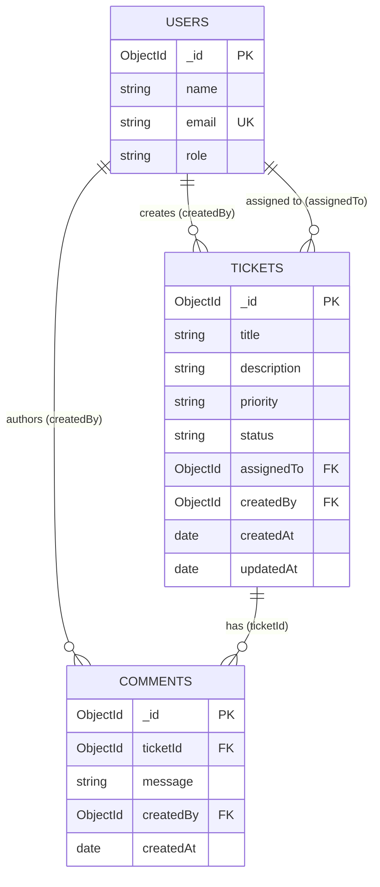
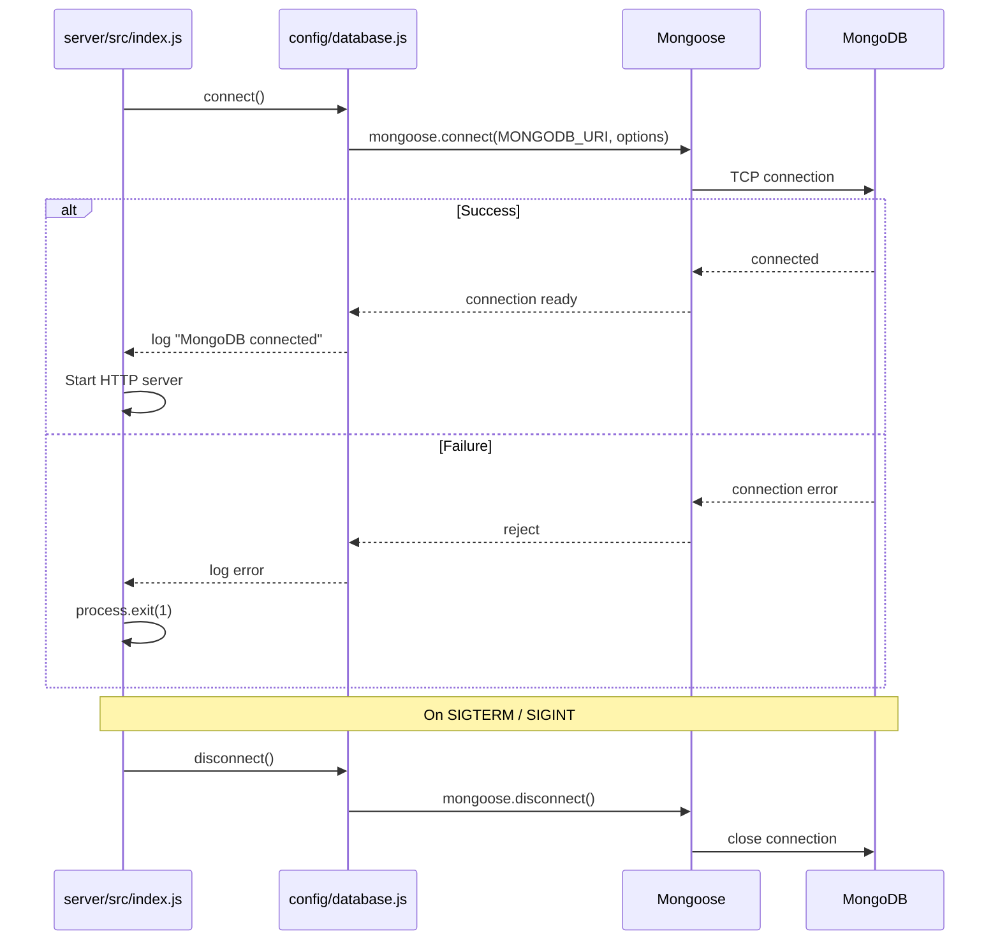

# Data Model — Support Ticket Management System

**Document version:** 1.0  
**Date:** 2026-07-11  
**ODM:** Mongoose  
**Database:** MongoDB 6+  
**Scope:** Core tier

**Source documents:**

- [`design-notes.md`](design-notes.md)
- [`api-contract.md`](api-contract.md)
- [`requirements-analysis.md`](requirements-analysis.md)
- [`tool-specific/cursor-workflow/spec.md`](tool-specific/cursor-workflow/spec.md) §8

> **Design principle:** MongoDB stores documents in three collections. Referential integrity for `createdBy`, `assignedTo`, and `ticketId` is enforced in the **Node.js service layer**, supplemented by Mongoose schema validation. There are no SQL-style foreign key constraints.

---

## Table of Contents

1. [Overview](#1-overview)
2. [Collections](#2-collections)
3. [Document Structures](#3-document-structures)
4. [Relationships](#4-relationships)
5. [Indexes](#5-indexes)
6. [Validation Rules](#6-validation-rules)
7. [Query Patterns](#7-query-patterns)
8. [Seed Data Strategy](#8-seed-data-strategy)
9. [Connection Strategy](#9-connection-strategy)
10. [Environment & Naming](#10-environment--naming)
11. [Testing Database Strategy](#11-testing-database-strategy)

---

## 1. Overview

### 1.1 Technology Stack

| Component | Choice |
|-----------|--------|
| Database | MongoDB 6+ (Community Server or Docker) |
| ODM | Mongoose (latest stable) |
| Driver | MongoDB Node.js driver (via Mongoose) |
| ID type | `ObjectId` (12-byte BSON) |
| Timestamps | UTC `Date`; exposed as ISO 8601 in API |

### 1.2 Database Names

| Environment | Database name | Connection source |
|-------------|---------------|-------------------|
| Development | `support-tickets` | `MONGODB_URI` |
| Test | `support-tickets-test` | `MONGODB_URI` or `mongodb-memory-server` |
| Production (future) | `support-tickets` | `MONGODB_URI` |

**Example URI:** `mongodb://localhost:27017/support-tickets`

### 1.3 Collection Summary

| Collection | Mongoose model name | Purpose | Core writes |
|------------|---------------------|---------|-------------|
| `users` | `User` | Seeded reference users | Seed script only |
| `tickets` | `Ticket` | Support ticket records | API create/update |
| `comments` | `Comment` | Ticket comments | API create only |

### 1.4 Design Decisions

| Decision | Choice | Rationale |
|----------|--------|-----------|
| Comments storage | Separate collection | Normalized; supports ticket detail query with sort |
| User refs | ObjectId + `ref: 'User'` | Enables `.populate()` for API responses |
| Referential integrity | Service layer | MongoDB has no native FK constraints |
| Deletes | Not implemented (Core) | Simplifies scope; seed data stable |
| Transactions | Not required (Core) | Single-document updates sufficient |
| Search (Core) | Case-insensitive `$regex` | Simple; text index optional enhancement |
| `assignedTo` nullability | `null` = unassigned | Explicit unassigned state |

---

## 2. Collections

### 2.1 Collection Map

```
support-tickets (database)
├── users        — seeded user accounts
├── tickets      — support tickets
└── comments     — comments linked to tickets
```

### 2.2 Estimated Document Counts (Core / Dev)

| Collection | Seed | Typical dev growth |
|------------|------|-------------------|
| `users` | 3–5 | Static (no API writes) |
| `tickets` | 5+ (one per status minimum) | Grows with usage |
| `comments` | 2+ | Grows with usage |

### 2.3 Mongoose Model Files (planned)

| Model | File path | Collection name |
|-------|-----------|-----------------|
| `User` | `server/src/models/User.js` | `users` |
| `Ticket` | `server/src/models/Ticket.js` | `tickets` |
| `Comment` | `server/src/models/Comment.js` | `comments` |

Mongoose pluralizes model names to collection names by default (`User` → `users`). Explicit `collection` option may be set for clarity but is not required.

---

## 3. Document Structures

### 3.1 User Collection (`users`)

**Purpose:** Seeded reference data for creators, assignees, and comment authors. Read-only via API in Core.

#### Document shape

| Field | BSON type | Mongoose type | Required | Default | Constraints |
|-------|-----------|---------------|----------|---------|-------------|
| `_id` | ObjectId | ObjectId | Auto | Auto-generated | Primary key |
| `name` | String | String | **Yes** | — | trim; maxlength 100 |
| `email` | String | String | **Yes** | — | trim; lowercase; unique; maxlength 255 |
| `role` | String | String | **Yes** | — | enum: `agent`, `admin`, `viewer` |
| `__v` | Number | Number | Auto | 0 | Mongoose version key (default) |

#### Example document

```json
{
  "_id": "507f191e810c19729de860ea",
  "name": "Jane Agent",
  "email": "jane.agent@example.com",
  "role": "agent"
}
```

#### Mongoose schema options (logical)

| Option | Value |
|--------|-------|
| `timestamps` | `false` (users are static in Core) |
| `toJSON` | Transform `_id` → `id` for API layer (optional virtual) |

---

### 3.2 Ticket Collection (`tickets`)

**Purpose:** Core entity — support requests tracked through lifecycle statuses.

#### Document shape

| Field | BSON type | Mongoose type | Required | Default | Constraints |
|-------|-----------|---------------|----------|---------|-------------|
| `_id` | ObjectId | ObjectId | Auto | Auto-generated | Primary key |
| `title` | String | String | **Yes** | — | trim; maxlength 200 |
| `description` | String | String | **Yes** | — | trim; maxlength 5000 |
| `priority` | String | String | **Yes** | — | enum: `low`, `medium`, `high`, `critical` |
| `status` | String | String | **Yes** | `open` | enum: `open`, `in_progress`, `resolved`, `closed`, `cancelled` |
| `assignedTo` | ObjectId \| null | ObjectId | No | `null` | ref: `User`; nullable |
| `createdBy` | ObjectId | ObjectId | **Yes** | — | ref: `User` |
| `createdAt` | Date | Date | Auto | now | Set on insert |
| `updatedAt` | Date | Date | Auto | now | Updated on every save |
| `__v` | Number | Number | Auto | 0 | Mongoose version key |

#### Example document

```json
{
  "_id": "507f1f77bcf86cd799439012",
  "title": "Cannot login to dashboard",
  "description": "User reports 500 error after entering credentials.",
  "priority": "high",
  "status": "open",
  "assignedTo": "507f1f77bcf86cd799439011",
  "createdBy": "507f191e810c19729de860ea",
  "createdAt": "2026-07-10T10:00:00.000Z",
  "updatedAt": "2026-07-10T10:00:00.000Z"
}
```

#### Mongoose schema options (logical)

| Option | Value |
|--------|-------|
| `timestamps` | `true` — maps to `createdAt`, `updatedAt` |
| `assignedTo` | `default: null` — explicit unassigned |

---

### 3.3 Comment Collection (`comments`)

**Purpose:** Append-only messages attached to tickets. Immutable in Core (no edit/delete).

#### Document shape

| Field | BSON type | Mongoose type | Required | Default | Constraints |
|-------|-----------|---------------|----------|---------|-------------|
| `_id` | ObjectId | ObjectId | Auto | Auto-generated | Primary key |
| `ticketId` | ObjectId | ObjectId | **Yes** | — | ref: `Ticket`; indexed |
| `message` | String | String | **Yes** | — | trim; maxlength 2000 |
| `createdBy` | ObjectId | ObjectId | **Yes** | — | ref: `User` |
| `createdAt` | Date | Date | Auto | now | Set on insert |
| `__v` | Number | Number | Auto | 0 | Mongoose version key |

#### Example document

```json
{
  "_id": "507f1f77bcf86cd799439013",
  "ticketId": "507f1f77bcf86cd799439012",
  "message": "Reproduced the issue in Chrome on macOS.",
  "createdBy": "507f191e810c19729de860ea",
  "createdAt": "2026-07-10T11:00:00.000Z"
}
```

#### Mongoose schema options (logical)

| Option | Value |
|--------|-------|
| `timestamps` | `{ createdAt: true, updatedAt: false }` — comments are immutable |
| Immutability | Enforced by API (no update/delete endpoints in Core) |

---

## 4. Relationships

### 4.1 Entity Relationship Diagram



### 4.2 Reference Definitions

| Source field | Target collection | Cardinality | Nullable | Populate fields (API) |
|--------------|-------------------|-------------|----------|------------------------|
| `tickets.createdBy` | `users` | N:1 | No | `name`, `email` |
| `tickets.assignedTo` | `users` | N:1 | Yes | `name`, `email` |
| `comments.ticketId` | `tickets` | N:1 | No | — (ticket fetched separately) |
| `comments.createdBy` | `users` | N:1 | No | `name`, `email` |

### 4.3 Mongoose `ref` Configuration (logical)

| Model | Field | `ref` value |
|-------|-------|-------------|
| `Ticket` | `createdBy` | `'User'` |
| `Ticket` | `assignedTo` | `'User'` |
| `Comment` | `ticketId` | `'Ticket'` |
| `Comment` | `createdBy` | `'User'` |

### 4.4 Referential Integrity (Service Layer)

Mongoose `ref` enables populate but **does not validate** that referenced documents exist on save. The service layer must verify:

| Operation | Checks before write |
|-----------|---------------------|
| Create ticket | `User.exists({ _id: createdBy })`; if `assignedTo` set, `User.exists({ _id: assignedTo })` |
| Update ticket assignee | If `assignedTo` non-null, user must exist |
| Create comment | `Ticket.exists({ _id: ticketId })`; `User.exists({ _id: createdBy })` |
| Change status | Ticket must exist (load by ID) |

**On missing reference:** throw `NotFoundError` → API `404 NOT_FOUND`.

### 4.5 Orphan Policy (Core)

| Scenario | Policy |
|----------|--------|
| Delete user referenced by tickets | Not implemented in Core; seed users are stable |
| Delete ticket with comments | Not implemented in Core |
| Invalid ref in seed data | Seed script must use valid cross-references |

**Stretch consideration:** If user delete is added, decide between `restrict`, `set null` on `assignedTo`, or soft-delete.

---

## 5. Indexes

### 5.1 Index Summary

| Collection | Index name (suggested) | Keys | Options | Priority |
|------------|------------------------|------|---------|----------|
| `users` | `email_1` | `{ email: 1 }` | `unique: true` | **Must** |
| `tickets` | `status_1` | `{ status: 1 }` | — | **Must** |
| `tickets` | `assignedTo_1` | `{ assignedTo: 1 }` | sparse optional | Should |
| `tickets` | `updatedAt_-1` | `{ updatedAt: -1 }` | — | **Should** |
| `tickets` | `title_text_description_text` | `{ title: "text", description: "text" }` | — | Optional (Stretch) |
| `comments` | `ticketId_1_createdAt_1` | `{ ticketId: 1, createdAt: 1 }` | — | **Must** |

### 5.2 Index Rationale

| Index | Supports |
|-------|----------|
| `users.email` unique | Prevent duplicate seed users; data integrity |
| `tickets.status` | `GET /api/tickets?status=open` filter |
| `tickets.assignedTo` | Future assignee filter (Stretch); sparse skips nulls |
| `tickets.updatedAt` desc | Default list sort (`updatedAt` descending) |
| Text index | Full-text search alternative to regex |
| `comments.ticketId + createdAt` | Detail view: comments for ticket, oldest first |

### 5.3 Index Creation Strategy

Indexes are created by:

1. **Mongoose schema definitions** — `schema.index(...)` declarations on each model
2. **`scripts/db-init.js`** — connects and calls `Model.syncIndexes()` for all models

| Requirement | Detail |
|-------------|--------|
| Idempotent | `syncIndexes()` safe to run multiple times |
| Timing | Run after deploy / on fresh clone before seed |
| Verification | Script logs indexes created per collection |

### 5.4 Search Without Text Index (Core default)

Case-insensitive regex query on `title` and `description`:

| Aspect | Detail |
|--------|--------|
| Query | `{ $or: [{ title: /term/i }, { description: /term/i }] }` |
| Index use | Collection scan acceptable for demo scale (<1000 docs) |
| Escaping | Service layer must escape regex special characters in user input |

---

## 6. Validation Rules

Validation occurs at **two layers**. Service-layer rules are authoritative; Mongoose provides a safety net.

### 6.1 Validation Layer Model

```
API Request
    → Service layer (business rules, referential integrity, state machine)
    → Mongoose schema (type, enum, required, maxlength, trim)
    → MongoDB BSON storage
```

### 6.2 User Schema Validation

| Field | Mongoose validators | Service rules |
|-------|---------------------|---------------|
| `name` | `required`, `trim`, `maxlength: 100` | — (seed only) |
| `email` | `required`, `trim`, `lowercase`, `unique`, `maxlength: 255` | Valid email format recommended in seed |
| `role` | `required`, `enum: ['agent','admin','viewer']` | — |

### 6.3 Ticket Schema Validation

| Field | Mongoose validators | Service rules |
|-------|---------------------|---------------|
| `title` | `required`, `trim`, `maxlength: 200` | Reject empty after trim on create/update |
| `description` | `required`, `trim`, `maxlength: 5000` | Reject empty after trim on create/update |
| `priority` | `required`, `enum: ['low','medium','high','critical']` | — |
| `status` | `required`, `enum: [5 values]`, `default: 'open'` | State machine on status change endpoint only |
| `assignedTo` | `ref: 'User'`, `default: null` | If set, user must exist; `null` clears assignee |
| `createdBy` | `required`, `ref: 'User'` | User must exist on create |
| `createdAt` | Auto via `timestamps` | — |
| `updatedAt` | Auto via `timestamps` | Refreshed on every update |

**Create-specific service rules:**

- Ignore client-provided `status`; always set `open`
- Reject `status` in field-update PATCH body

### 6.4 Comment Schema Validation

| Field | Mongoose validators | Service rules |
|-------|---------------------|---------------|
| `ticketId` | `required`, `ref: 'Ticket'` | Ticket must exist (any status) |
| `message` | `required`, `trim`, `maxlength: 2000` | Reject empty after trim |
| `createdBy` | `required`, `ref: 'User'` | User must exist |
| `createdAt` | Auto | — |

### 6.5 Enum Values (Canonical)

| Enum | Values |
|------|--------|
| `role` | `agent`, `admin`, `viewer` |
| `priority` | `low`, `medium`, `high`, `critical` |
| `status` | `open`, `in_progress`, `resolved`, `closed`, `cancelled` |

**Consistency rule:** Enum strings in MongoDB must match API JSON exactly (lowercase snake_case for `in_progress`).

### 6.6 Mongoose Error Mapping

| Mongoose error | API mapping |
|----------------|-------------|
| `ValidationError` | `400 VALIDATION_ERROR` with field details |
| `CastError` (invalid ObjectId) | `400 INVALID_OBJECT_ID` |
| Duplicate key (`email`) | `400 VALIDATION_ERROR` — "Email already exists" |

### 6.7 Security-Related Data Rules

| Rule | Implementation |
|------|----------------|
| NoSQL injection | Use typed Mongoose queries; never pass raw `req.body` to `$where` |
| Regex injection | Escape user search input before `$regex` |
| Mass assignment | Service layer picks allowed fields per operation |

---

## 7. Query Patterns

### 7.1 List Tickets (with filters)

| Step | Operation |
|------|-----------|
| Filter | `{ status }` if provided; `$or` regex on title/description if `search` provided |
| Sort | `{ updatedAt: -1 }` |
| Populate | `createdBy`, `assignedTo` — select `name email` |
| Projection | All ticket fields |

### 7.2 Get Ticket Detail

| Step | Collection | Operation |
|------|------------|-----------|
| 1 | `tickets` | `findById(id).populate('createdBy assignedTo', 'name email')` |
| 2 | `comments` | `find({ ticketId: id }).sort({ createdAt: 1 }).populate('createdBy', 'name email')` |

Returned as single API payload: `{ ticket, comments }`.

### 7.3 Create Ticket

| Step | Operation |
|------|-----------|
| Validate | Service checks users exist |
| Insert | `Ticket.create({ title, description, priority, status: 'open', assignedTo, createdBy })` |
| Return | Populated document |

### 7.4 Update Ticket Fields

| Step | Operation |
|------|-----------|
| Validate | Reject `status` in payload; validate field values |
| Update | `findByIdAndUpdate(id, { $set: fields }, { new: true, runValidators: true })` |
| Note | `runValidators: true` ensures Mongoose validators on partial update |

### 7.5 Change Status

| Step | Operation |
|------|-----------|
| Load | `findById(id)` |
| Validate | `canTransition(current, requested)` in service |
| Save | `ticket.status = newStatus`; `ticket.save()` (triggers `updatedAt`) |

Single-document atomic save — no transaction required for Core.

### 7.6 Create Comment

| Step | Operation |
|------|-----------|
| Validate | Ticket and user exist |
| Insert | `Comment.create({ ticketId, message, createdBy })` |
| Return | Populated `createdBy` |

### 7.7 List Users

| Step | Operation |
|------|-----------|
| Query | `User.find({}).sort({ name: 1 })` |
| Projection | All fields |

---

## 8. Seed Data Strategy

### 8.1 Scripts

| Script | Path | Purpose |
|--------|------|---------|
| DB init | `scripts/db-init.js` | Sync indexes on all collections |
| Seed | `scripts/seed.js` | Insert development sample data |

### 8.2 Execution Order (fresh setup)

```
1. Start MongoDB
2. node scripts/db-init.js     → ensure indexes
3. node scripts/seed.js        → insert sample data
4. Start API server
```

### 8.3 Seed — Users (minimum 3)

| # | Name | Email | Role |
|---|------|-------|------|
| 1 | Jane Agent | `jane.agent@example.com` | `agent` |
| 2 | Bob Admin | `bob.admin@example.com` | `admin` |
| 3 | Carol Viewer | `carol.viewer@example.com` | `viewer` |

Optional: add 1–2 more agents for assignee variety.

### 8.4 Seed — Tickets (minimum 5 — one per status)

| # | Title (example) | Status | Priority | Assignee | Creator |
|---|-----------------|--------|----------|----------|---------|
| 1 | Cannot login to dashboard | `open` | `high` | Bob Admin | Jane Agent |
| 2 | Email notifications delayed | `in_progress` | `medium` | Jane Agent | Bob Admin |
| 3 | Export report missing data | `resolved` | `high` | Jane Agent | Jane Agent |
| 4 | Update user profile documentation | `closed` | `low` | Bob Admin | Carol Viewer |
| 5 | Duplicate invoice generated | `cancelled` | `medium` | — (unassigned) | Jane Agent |

Each ticket must have realistic `title` and `description` text for search demo.

### 8.5 Seed — Comments (minimum 2)

| # | Ticket | Author | Message (example) |
|---|--------|--------|-------------------|
| 1 | Ticket #2 (`in_progress`) | Jane Agent | "Investigating SMTP relay configuration." |
| 2 | Ticket #3 (`resolved`) | Bob Admin | "Fix deployed to staging. Awaiting verification." |

### 8.6 Seed Idempotency Strategy

| Mode | Behavior | When to use |
|------|----------|-------------|
| **Default (recommended)** | Clear `tickets` and `comments`; upsert `users` by email | Development re-seed |
| `--force` | Drop and recreate all three collections | Clean slate |
| Skip if data exists | Exit without changes if tickets count > 0 | CI caution |

**Document chosen mode in README.** Default should not fail on re-run.

### 8.7 Seed Constraints

| Rule | Detail |
|------|--------|
| Valid refs | All `createdBy`, `assignedTo`, `ticketId` must reference seeded documents |
| Status coverage | At least one ticket per status enum value |
| No production use | Seed clears data — dev/local only |
| Timestamps | Use realistic past dates for `createdAt`/`updatedAt` variety |

### 8.8 Test Fixtures (separate from seed)

Integration tests use programmatic fixtures in `server/tests/helpers/fixtures.js`:

| Fixture | Purpose |
|---------|---------|
| `createUser(overrides)` | Insert minimal user; return `_id` |
| `createTicket(overrides)` | Insert ticket in specified `status` |
| `createComment(ticketId, overrides)` | Insert comment linked to ticket |

Test fixtures use `mongodb-memory-server` — **not** the dev seed script.

---

## 9. Connection Strategy

### 9.1 Configuration

| Variable | Required | Example | Description |
|----------|----------|---------|-------------|
| `MONGODB_URI` | **Yes** | `mongodb://localhost:27017/support-tickets` | Full connection string |
| `NODE_ENV` | No | `development` | Environment label |

**File:** `server/src/config/env.js` validates `MONGODB_URI` at startup.

### 9.2 Connection Lifecycle



### 9.3 Mongoose Connection Options (recommended)

| Option | Value | Purpose |
|--------|-------|---------|
| `serverSelectionTimeoutMS` | `5000` | Fail fast if MongoDB unreachable |
| `maxPoolSize` | `10` | Sufficient for local/single instance |
| `autoIndex` | `false` in production | Indexes via `db-init.js`; avoid startup cost |

**Development:** `autoIndex: true` acceptable for convenience; prefer explicit `syncIndexes()` for clarity.

### 9.4 Connection Module Responsibilities

**File:** `server/src/config/database.js`

| Function | Responsibility |
|----------|----------------|
| `connect()` | Call `mongoose.connect()`; register event listeners |
| `disconnect()` | Graceful `mongoose.disconnect()` on shutdown |
| `getConnectionState()` | Optional helper for health checks |

### 9.5 Event Handling

| Event | Action |
|-------|--------|
| `connected` | Log info: database name, host |
| `error` | Log error; do not crash on transient errors after initial connect |
| `disconnected` | Log warn |
| Initial connect failure | Log error; `process.exit(1)` — server must not start without DB |

### 9.6 Server Startup Order

```
1. Load environment variables
2. await connect()        ← MongoDB must connect first
3. Register Express routes
4. Listen on PORT
```

### 9.7 Graceful Shutdown

| Signal | Action |
|--------|--------|
| `SIGTERM` | Stop accepting HTTP requests → `disconnect()` → exit 0 |
| `SIGINT` | Same as SIGTERM (Ctrl+C local dev) |

### 9.8 Health Check (optional, Should)

| Endpoint | Checks |
|----------|--------|
| `GET /api/health` | `mongoose.connection.readyState === 1` |

Not required for Core but useful for debugging.

---

## 10. Environment & Naming

### 10.1 Naming Conventions

| Item | Convention | Example |
|------|------------|---------|
| Collection names | lowercase plural | `users`, `tickets`, `comments` |
| Model names | PascalCase singular | `User`, `Ticket`, `Comment` |
| Field names | camelCase | `createdBy`, `assignedTo`, `ticketId` |
| Enum values | lowercase snake_case | `in_progress` |
| `_id` in API | Exposed as `id` | Transform in serializer |

### 10.2 Files & Environment

| File | Purpose | Committed |
|------|---------|-----------|
| `.env.example` | Placeholder `MONGODB_URI` | Yes |
| `.env` | Real local connection string | **No** (gitignored) |

### 10.3 Docker MongoDB (optional local setup)

| Setting | Value |
|---------|-------|
| Image | `mongo:7` |
| Port | `27017:27017` |
| Volume | Named volume for data persistence |
| URI | `mongodb://localhost:27017/support-tickets` |

Document in README if Docker option is provided.

---

## 11. Testing Database Strategy

### 11.1 Approach

| Component | Choice |
|-----------|--------|
| Test runner | Vitest or Jest |
| In-memory MongoDB | `mongodb-memory-server` (recommended) |
| Database name | Auto-generated per test run |
| Isolation | Drop collections in `beforeEach` or `afterEach` |

### 11.2 Test Lifecycle

```
beforeAll  → start mongodb-memory-server; connect Mongoose
beforeEach → clear users, tickets, comments (or drop database)
afterAll   → disconnect; stop memory server
```

### 11.3 Test vs Development Separation

| Aspect | Development | Test |
|--------|-------------|------|
| Database | `support-tickets` on localhost | In-memory URI |
| Seed script | `scripts/seed.js` | Programmatic fixtures |
| Data persistence | Survives restart | Ephemeral per test |

### 11.4 Index Handling in Tests

| Option | Detail |
|--------|--------|
| `autoIndex: true` in test env | Indexes created on first use |
| Or call `syncIndexes()` in `beforeAll` | Mirrors production init |

---

## Appendix A — Document Size Estimates

| Collection | Avg doc size (est.) | 1000 docs |
|------------|---------------------|-----------|
| `users` | ~200 B | ~200 KB |
| `tickets` | ~1–2 KB | ~1–2 MB |
| `comments` | ~500 B | ~500 KB |

Well within MongoDB local dev limits.

---

## Appendix B — Requirement Traceability

| Design area | Requirements | Acceptance criteria |
|-------------|--------------|---------------------|
| Three collections | FR-D01 | DB-01 |
| Persistence | FR-D02 | DB-17, DB-18 |
| Init scripts | FR-D03 | DB-11 |
| Seed data | FR-D04 | DB-12 – DB-15 |
| ObjectId refs | NFR-02 | DB-06 |
| Indexes | NFR-17 | DB-07 – DB-10 |
| `MONGODB_URI` | NFR-05 | DB-21, DB-22 |
| Test isolation | NFR-12 | §11 |

---

## Appendix C — Future Stretch Considerations

| Feature | Schema impact |
|---------|---------------|
| Authentication | `users.passwordHash`, `users.refreshTokens` |
| Audit log | New `ticketHistory` collection |
| Pagination | Existing indexes support `skip/limit`; consider cursor-based |
| Attachments | New `attachments` collection with `ticketId` ref |
| Soft delete | `deletedAt` field on tickets |
| Transactions | Multi-document updates if audit log added |

---

*This document is the database design baseline for Mongoose model implementation. Models, seed script, and `db-init.js` must conform to these definitions.*
