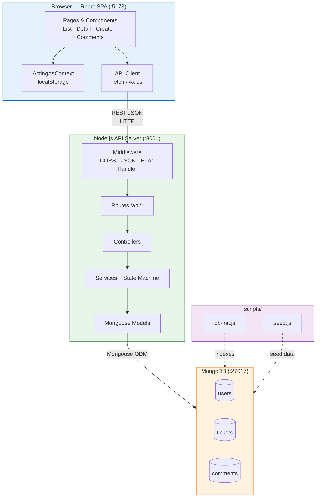
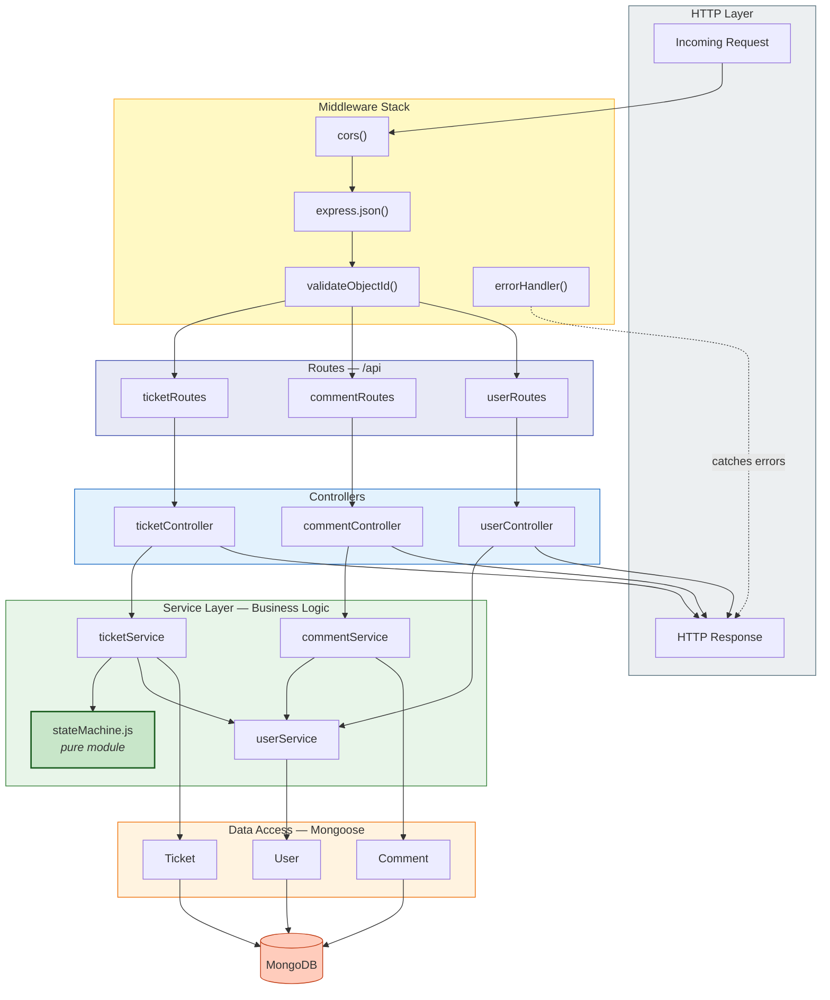
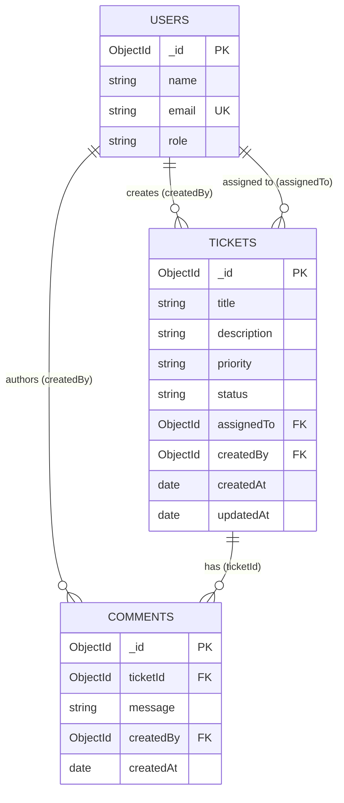
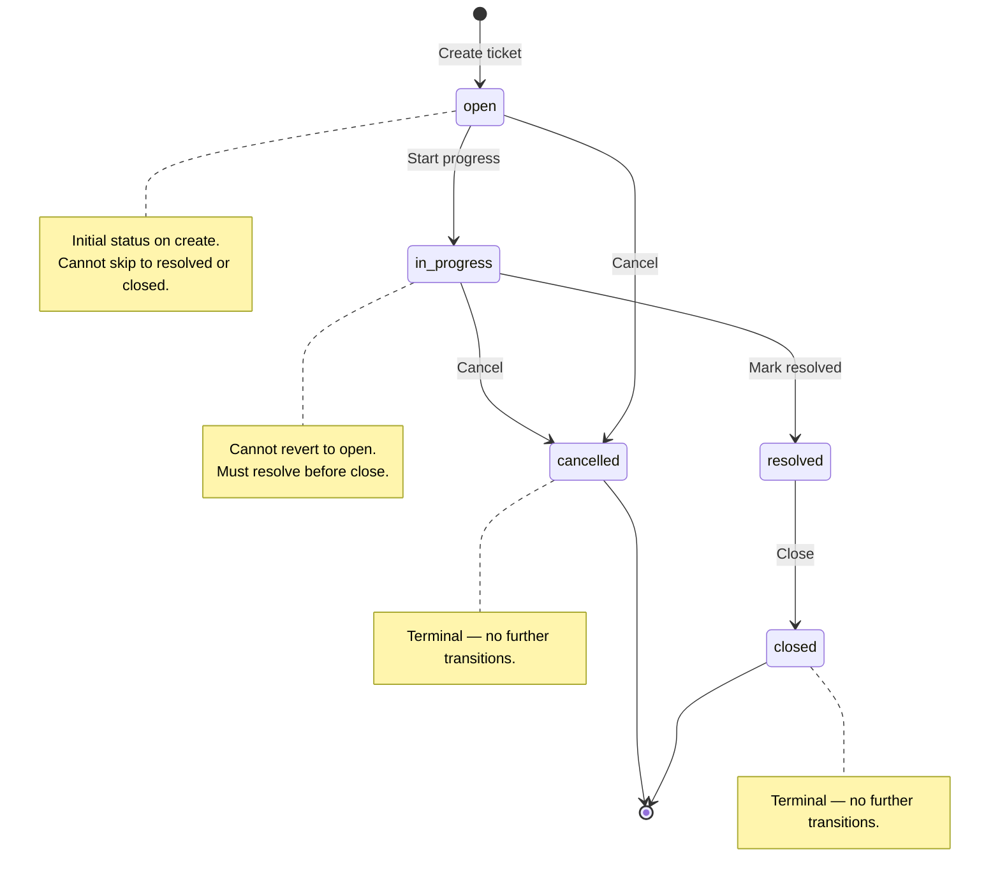
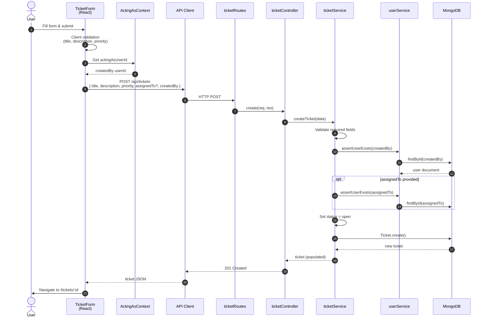
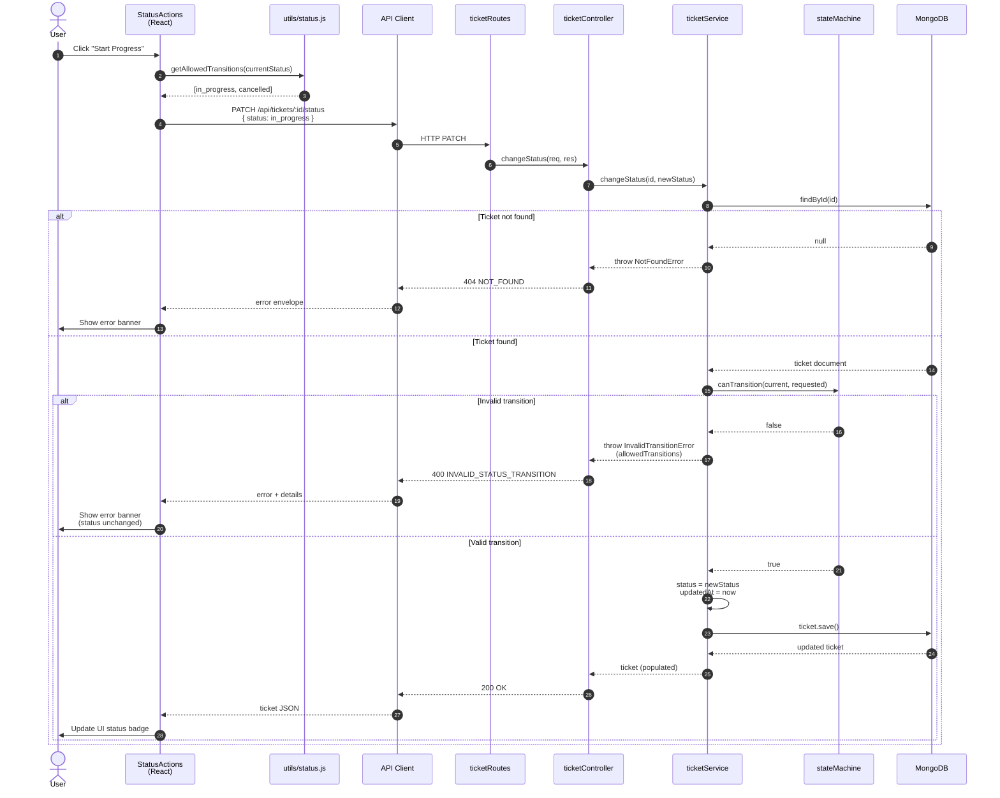
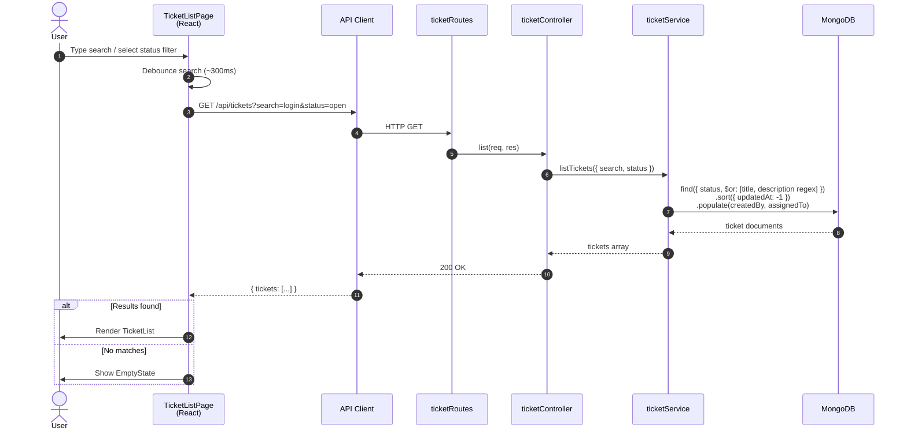
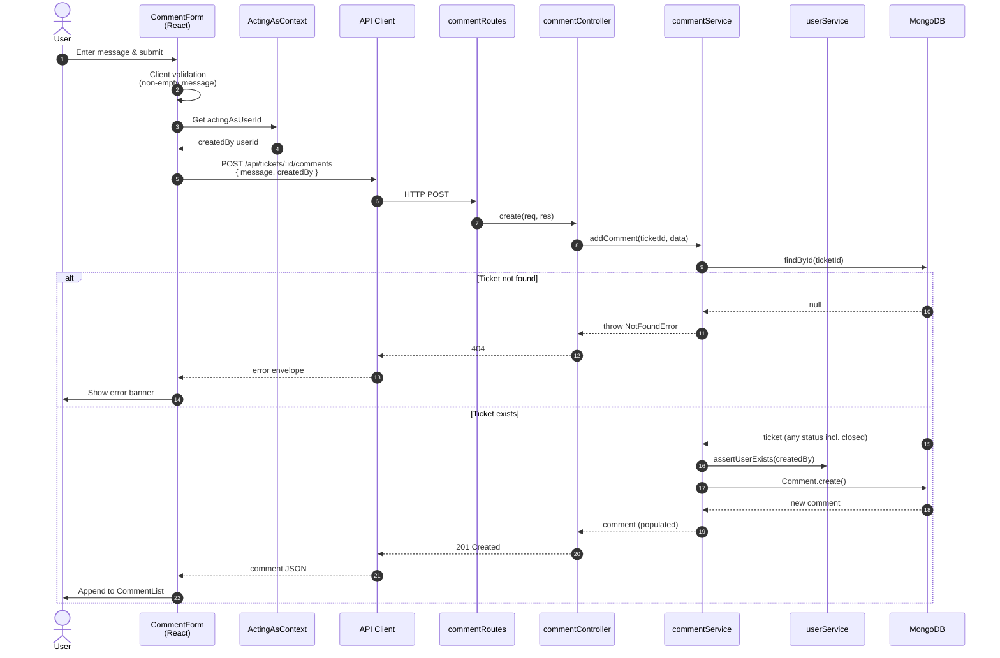
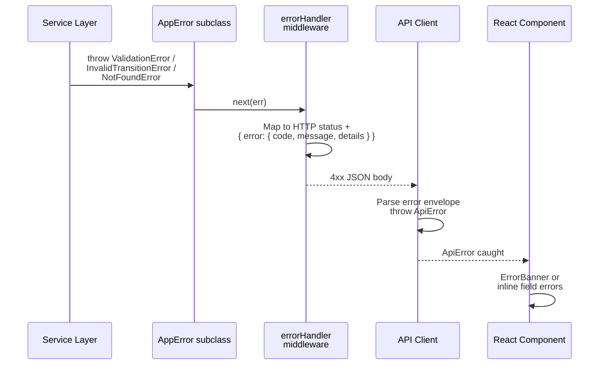

# Design Notes

**Document version:** 1.0  
**Date:** 2026-07-18  
**Scope:** Core tier

This document consolidates cross-cutting architecture and design decisions. Detailed contracts live in companion artifacts (no content removed — partitioned to avoid duplication):

| Document | Contents |
|----------|----------|
| [`api-contract.md`](api-contract.md) | REST endpoints, schemas, error model |
| [`data-model.md`](data-model.md) | MongoDB collections, indexes, seed, connection |
| [`ui-flow.md`](ui-flow.md) | Screens, wireframes, UX flows, UI states |
| [`test-strategy.md`](test-strategy.md) | Test scope and matrices |

**Deep reference:** [`tool-specific/cursor-workflow/spec.md`](tool-specific/cursor-workflow/spec.md)

---

## Architecture Overview (frontend, backend, database)

## 1. High-Level Architecture

### 1.1 System Context

The Support Ticket Management System is a three-tier, locally hosted application for internal support teams. It has no authentication in Core; users are seeded in MongoDB and selected in the UI via an "Acting as" control.

```
┌─────────────────────────────────────────────────────────────────────────┐
│                         Browser (React SPA)                              │
│  ┌──────────────┐  ┌──────────────┐  ┌──────────────┐  ┌─────────────┐ │
│  │ Ticket List  │  │Ticket Detail │  │ Create/Edit  │  │ Acting-as   │ │
│  │ + Search     │  │ + Comments   │  │   Forms      │  │  Selector   │ │
│  └──────┬───────┘  └──────┬───────┘  └──────┬───────┘  └──────┬──────┘ │
│         │                 │                 │                  │         │
│         └─────────────────┴────────┬────────┴──────────────────┘         │
│                                    │                                     │
│                          ┌─────────▼─────────┐                           │
│                          │   API Client      │                           │
│                          │  (fetch / Axios)  │                           │
│                          └─────────┬─────────┘                           │
└────────────────────────────────────┼─────────────────────────────────────┘
                                     │ HTTP/JSON (REST)
                                     │ CORS enabled (dev)
┌────────────────────────────────────▼─────────────────────────────────────┐
│                      Node.js API Server (:3001)                          │
│  ┌──────────┐  ┌──────────────┐  ┌──────────────┐  ┌─────────────────┐  │
│  │  Routes  │→ │ Controllers  │→ │   Services   │→ │ Models (ODM)    │  │
│  └──────────┘  └──────────────┘  │ + State      │  └────────┬────────┘  │
│                                   │   Machine    │           │          │
│  ┌──────────────────────────────┐ └──────────────┘           │          │
│  │ Middleware: CORS, JSON,      │                            │          │
│  │ Error Handler, ObjectId      │                            │          │
│  └──────────────────────────────┘                            │          │
└──────────────────────────────────────────────────────────────┼──────────┘
                                                               │ Wire Protocol
┌──────────────────────────────────────────────────────────────▼──────────┐
│                         MongoDB (:27017)                                 │
│   ┌─────────┐      ┌──────────┐      ┌───────────┐                        │
│   │  users  │◄─────│ tickets  │◄─────│ comments  │                        │
│   └─────────┘      └──────────┘      └───────────┘                        │
└─────────────────────────────────────────────────────────────────────────┘
```

### 1.2 Architectural Style

| Aspect | Decision |
|--------|----------|
| **Pattern** | Client–server with REST API |
| **Frontend** | Single-page application (SPA); client-side routing |
| **Backend** | Layered monolith (routes → controllers → services → models) |
| **Data** | Document store (MongoDB) with referenced documents |
| **Deployment (Core)** | Local dev: two processes (React dev server + Node API) + MongoDB |
| **Auth (Core)** | None — trusted internal context |

### 1.3 Technology Selection

| Layer | Technology | Version guidance |
|-------|------------|------------------|
| Frontend | React + Vite (recommended) or CRA | React 18+ |
| Routing | React Router | v6+ |
| HTTP client | Native `fetch` or Axios | Either acceptable |
| Backend | Node.js + Express (recommended) or Fastify | Node 20 LTS |
| ODM | Mongoose | Latest stable |
| Database | MongoDB | 6+ (Community or Docker) |
| Testing | Vitest/Jest + Supertest + mongodb-memory-server | Document in README |

### 1.4 Cross-Cutting Concerns

| Concern | Owner | Approach |
|---------|-------|----------|
| Business rules | Backend service layer | Single source of truth |
| State machine | `server/src/services/stateMachine.js` | Pure functions + service integration |
| Validation | Backend (authoritative) + Frontend (UX) | Duplicate rules only for immediate feedback |
| Error format | Backend middleware | Uniform JSON error envelope |
| Timestamps | MongoDB / Mongoose | UTC `Date` objects; ISO 8601 in API responses |
| Configuration | Environment variables | `.env` + `.env.example` |

### 1.5 Repository Layout

Monorepo structure per `project-context.md`:

```
client/          → React SPA (port 5173 or 3000)
server/          → Node.js API (port 3001)
scripts/         → db-init.js, seed.js
(root)           → assessment artifacts (requirements, design, ai-prompts/, etc.)
```

---

## Component Responsibilities

## 2. Component Responsibilities

### 2.1 System Component Map

```
┌─────────────────────────────────────────────────────────────────┐
│                        FRONTEND (client/)                        │
├─────────────────────────────────────────────────────────────────┤
│ App                    │ Root layout, router, global providers   │
│ ActingAsSelector       │ Persist selected user; expose to forms  │
│ TicketListPage         │ List, search, status filter             │
│ TicketDetailPage       │ Detail, comments, status actions        │
│ TicketForm             │ Create / edit ticket fields             │
│ CommentForm            │ Add comment                             │
│ StatusActions          │ Valid transition buttons only           │
│ api/tickets.js         │ Ticket API calls                        │
│ api/comments.js        │ Comment API calls                       │
│ api/users.js           │ User list for dropdowns                 │
│ hooks/useTickets.js    │ Data fetching + loading/error state     │
│ utils/status.js        │ Display labels; mirror transition map   │
└─────────────────────────────────────────────────────────────────┘

┌─────────────────────────────────────────────────────────────────┐
│                        BACKEND (server/)                         │
├─────────────────────────────────────────────────────────────────┤
│ app.js                 │ Express app, middleware, route mount  │
│ routes/ticketRoutes    │ HTTP path → controller binding          │
│ routes/commentRoutes   │ Nested under tickets                  │
│ routes/userRoutes      │ Read-only user endpoints                │
│ controllers/*          │ Parse request, call service, respond  │
│ services/ticketService │ Ticket CRUD, search, field updates    │
│ services/commentService│ Comment creation, listing               │
│ services/userService   │ User lookup, existence checks           │
│ services/stateMachine  │ canTransition, getAllowedTransitions    │
│ models/User            │ Mongoose schema                         │
│ models/Ticket          │ Mongoose schema                         │
│ models/Comment         │ Mongoose schema                         │
│ middleware/errorHandler│ Catch-all; format errors                │
│ middleware/validateObjectId │ Reject malformed :id params         │
│ config/database.js     │ MongoDB connection                    │
└─────────────────────────────────────────────────────────────────┘

┌─────────────────────────────────────────────────────────────────┐
│                        DATA (scripts/)                           │
├─────────────────────────────────────────────────────────────────┤
│ db-init.js             │ Ensure indexes exist                    │
│ seed.js                │ Populate users, tickets, comments       │
└─────────────────────────────────────────────────────────────────┘
```

### 2.2 Responsibility Matrix

| Component | Responsibility | Must NOT do |
|-----------|----------------|-------------|
| **React pages** | Render UI, orchestrate user actions, manage local UI state | Enforce business rules as sole authority |
| **API client** | HTTP calls, parse JSON, throw typed errors on failure | Contain business logic |
| **Routes** | Map URLs and HTTP verbs to controllers | Contain business logic or DB access |
| **Controllers** | Extract params/body, invoke services, set HTTP status | Implement state machine or complex validation |
| **Services** | Business logic, validation orchestration, referential checks | Know about HTTP (no `req`/`res`) |
| **State machine module** | Pure transition rules | Access database |
| **Models** | Schema, indexes, document shape | Application workflow logic |
| **Error middleware** | Catch exceptions, map to HTTP + JSON | Swallow errors silently |

### 2.3 Inter-Component Dependencies

```
Controllers  →  Services  →  Models  →  MongoDB
Controllers  →  StateMachine (via ticketService)
React Pages  →  API Client  →  REST API  →  Controllers
StatusActions → utils/status.js (reads shared transition map concept)
```

**Rule:** Dependencies flow inward. Services never import from controllers or routes.

---

## Frontend Design

Screen-level design, wireframes, and user journeys are documented in [`ui-flow.md`](ui-flow.md). The following covers frontend **implementation architecture** from the technical specification.

## 3. Frontend Architecture

### 3.1 Application Structure

```
client/src/
├── main.jsx                 # React DOM entry
├── App.jsx                  # Router + layout shell
├── api/
│   ├── client.js            # Base fetch wrapper, error parsing
│   ├── tickets.js           # getTickets, getTicket, create, update, changeStatus
│   ├── comments.js          # addComment
│   └── users.js             # getUsers
├── pages/
│   ├── TicketListPage.jsx   # /tickets
│   ├── TicketDetailPage.jsx # /tickets/:id
│   └── CreateTicketPage.jsx # /tickets/new
├── components/
│   ├── layout/
│   │   ├── AppHeader.jsx
│   │   └── ActingAsSelector.jsx
│   ├── tickets/
│   │   ├── TicketList.jsx
│   │   ├── TicketCard.jsx
│   │   ├── TicketForm.jsx
│   │   ├── TicketMeta.jsx
│   │   ├── StatusBadge.jsx
│   │   └── StatusActions.jsx
│   ├── comments/
│   │   ├── CommentList.jsx
│   │   └── CommentForm.jsx
│   └── common/
│       ├── SearchBar.jsx
│       ├── StatusFilter.jsx
│       ├── LoadingSpinner.jsx
│       ├── ErrorBanner.jsx
│       └── EmptyState.jsx
├── hooks/
│   ├── useActingAs.js       # Selected user in React context or localStorage
│   └── useApi.js            # Optional: generic async hook
├── context/
│   └── ActingAsContext.jsx  # Provides current user to descendants
└── utils/
    ├── status.js            # Labels, allowed transitions (UX mirror)
    ├── priority.js          # Priority display labels
    └── formatDate.js        # ISO → readable string
```

### 3.2 Routing

| Path | Page | Purpose |
|------|------|---------|
| `/` | Redirect → `/tickets` | Default landing |
| `/tickets` | `TicketListPage` | List with search and filter |
| `/tickets/new` | `CreateTicketPage` | Create ticket form |
| `/tickets/:id` | `TicketDetailPage` | Detail, edit, comments, status |

Use **React Router v6** with a shared layout (`AppHeader` + `ActingAsSelector`).

### 3.3 State Management

| State type | Storage | Examples |
|------------|---------|----------|
| **Server state** | Fetched on demand; refetch after mutations | Tickets, comments, users |
| **UI state** | Component `useState` | Form inputs, search text, filter selection |
| **Global client state** | React Context + `localStorage` | Acting-as user selection |
| **URL state** | Query params (optional) | `?search=&status=` on list page |

**No Redux required for Core.** Context + hooks are sufficient.

### 3.4 Acting-as User Pattern

Because Core has no authentication:

1. On app load, fetch `GET /api/users` and populate `ActingAsSelector`.
2. Default to first seeded user if none stored.
3. Persist selection in `localStorage` key `actingAsUserId`.
4. Pass `createdBy: actingAsUserId` on ticket create and comment create.
5. Display acting user name in header for clarity.

### 3.5 UI Behavior by View

#### Ticket List Page

- Fetch tickets on mount and when search/filter changes (debounce search ~300ms).
- Display: title, status badge, priority, assignee name, updated date.
- Empty state when no tickets match.
- Link each row/card to detail page.
- "Create ticket" navigation button.

#### Ticket Detail Page

- Fetch ticket by ID including embedded or joined comments.
- Editable fields: title, description, priority, assignee (dropdown of users).
- `StatusActions`: render only buttons for `getAllowedTransitions(currentStatus)`.
- On status button click → `PATCH /api/tickets/:id/status` → handle success/error.
- `CommentList` chronological (oldest first).
- `CommentForm` at bottom; disabled if no acting user.

#### Create Ticket Page

- Form: title, description, priority (default `medium`), assignee (optional).
- `createdBy` from acting-as context (not a form field).
- Client-side required field check before submit.
- On success → navigate to detail page.

### 3.6 Frontend State Machine Mirror (UX Only)

`utils/status.js` exposes the same allowed transitions as the backend for UI gating:

| Function | Purpose |
|----------|---------|
| `getAllowedTransitions(status)` | Returns array of target statuses for buttons |
| `getStatusLabel(status)` | Human-readable label ("In Progress") |
| `isTerminal(status)` | `true` for `closed`, `cancelled` |

**Critical:** If API rejects a transition, show `ErrorBanner` with server message — do not assume frontend map is authoritative.

### 3.7 Frontend Non-Functional Behavior

| Concern | Specification |
|---------|---------------|
| Loading | Show spinner or skeleton while fetching |
| Errors | `ErrorBanner` for API failures; inline errors for form validation |
| Empty | Dedicated empty state components with guidance text |
| Accessibility | Semantic HTML, form labels, button text describing action |
| XSS | React default escaping; never `dangerouslySetInnerHTML` for user content |

---

## Backend Design

## 4. Backend Architecture

### 4.1 Layered Architecture

```
HTTP Request
    │
    ▼
┌─────────────────────────────────────────────────────────┐
│  Middleware Stack                                        │
│  1. cors()                                               │
│  2. express.json()                                       │
│  3. request logging (optional)                           │
│  4. validateObjectId (on :id params)                     │
└─────────────────────────┬───────────────────────────────┘
                          ▼
┌─────────────────────────────────────────────────────────┐
│  Routes                                                  │
│  /api/tickets  /api/tickets/:id  /api/tickets/:id/...   │
│  /api/users                                              │
└─────────────────────────┬───────────────────────────────┘
                          ▼
┌─────────────────────────────────────────────────────────┐
│  Controllers                                             │
│  - Extract and pass DTOs to services                     │
│  - Map service results → HTTP response                   │
│  - Map service errors → thrown AppError                  │
└─────────────────────────┬───────────────────────────────┘
                          ▼
┌─────────────────────────────────────────────────────────┐
│  Services                                                │
│  ticketService | commentService | userService            │
│  - Validation                                            │
│  - Referential integrity checks                          │
│  - State machine invocation                              │
│  - Orchestrate model operations                          │
└─────────────────────────┬───────────────────────────────┘
                          ▼
┌─────────────────────────────────────────────────────────┐
│  Models (Mongoose)                                       │
│  User | Ticket | Comment                                 │
└─────────────────────────┬───────────────────────────────┘
                          ▼
                      MongoDB
```

### 4.2 Server Directory Structure

```
server/
├── src/
│   ├── app.js
│   ├── index.js              # Start server, connect DB
│   ├── config/
│   │   ├── database.js
│   │   └── env.js
│   ├── routes/
│   │   ├── index.js          # Mount all routes under /api
│   │   ├── ticketRoutes.js
│   │   ├── commentRoutes.js
│   │   └── userRoutes.js
│   ├── controllers/
│   │   ├── ticketController.js
│   │   ├── commentController.js
│   │   └── userController.js
│   ├── services/
│   │   ├── ticketService.js
│   │   ├── commentService.js
│   │   ├── userService.js
│   │   └── stateMachine.js
│   ├── models/
│   │   ├── User.js
│   │   ├── Ticket.js
│   │   └── Comment.js
│   ├── middleware/
│   │   ├── errorHandler.js
│   │   ├── validateObjectId.js
│   │   └── asyncHandler.js   # Wrap async controllers
│   ├── errors/
│   │   ├── AppError.js
│   │   └── errorCodes.js
│   └── utils/
│       └── objectId.js
└── tests/
    ├── integration/
    │   ├── setup.js          # DB connect, seed, teardown
    │   ├── stateMachine.test.js
    │   ├── tickets.test.js
    │   └── comments.test.js
    └── helpers/
        └── fixtures.js
```

### 4.3 Service Layer Contracts

#### ticketService

| Method | Input | Output | Side effects |
|--------|-------|--------|--------------|
| `listTickets({ search, status })` | Query filters | `Ticket[]` with populated user refs | Read |
| `getTicketById(id)` | ObjectId | Ticket + comments | Read |
| `createTicket(data)` | Create DTO | Created ticket | Write |
| `updateTicket(id, data)` | Update DTO (no status) | Updated ticket | Write |
| `changeStatus(id, newStatus)` | Target status | Updated ticket | Write; state machine check |

#### commentService

| Method | Input | Output | Side effects |
|--------|-------|--------|--------------|
| `addComment(ticketId, data)` | message, createdBy | Created comment | Write |
| `getCommentsByTicketId(ticketId)` | ObjectId | Comment[] | Read |

#### userService

| Method | Input | Output | Side effects |
|--------|-------|--------|--------------|
| `listUsers()` | — | User[] | Read |
| `getUserById(id)` | ObjectId | User or null | Read |
| `assertUserExists(id)` | ObjectId | void or throw | Read |

### 4.4 Status vs Field Update Separation

**Design decision (resolves Q-01):** Status changes use a **dedicated endpoint** `PATCH /api/tickets/:id/status`.

| Endpoint | Accepts `status`? | Behavior |
|----------|-------------------|----------|
| `PATCH /api/tickets/:id` | **No** — reject if `status` in body | Updates title, description, priority, assignedTo only |
| `PATCH /api/tickets/:id/status` | **Yes** — `{ "status": "in_progress" }` | Runs state machine validation |

This prevents accidental status bypass via the general update path.

### 4.5 Application Error Types

| Error class | HTTP | Code | When |
|-------------|------|------|------|
| `ValidationError` | 400 | `VALIDATION_ERROR` | Invalid field values |
| `InvalidTransitionError` | 400 | `INVALID_STATUS_TRANSITION` | State machine rejection |
| `NotFoundError` | 404 | `NOT_FOUND` | Ticket, user, or comment parent missing |
| `BadRequestError` | 400 | `BAD_REQUEST` | Malformed ObjectId in body |
| Internal | 500 | `INTERNAL_ERROR` | Unhandled exception (safe message only) |

### 4.6 Concurrency Strategy

**Design decision:** Last-write-wins for Core. Document in README.

- No optimistic locking version field in Core.
- `updatedAt` always overwritten on successful update.
- Stretch may add `version` field if needed.

---

## API Communication Flow

Endpoint-level request/response contracts are in [`api-contract.md`](api-contract.md). Sequence-level flows:

## 5. API Communication Flow

### 5.1 Request/Response Conventions

| Convention | Value |
|------------|-------|
| Base URL | `http://localhost:3001/api` |
| Content-Type | `application/json` |
| Charset | UTF-8 |
| Date format | ISO 8601 strings in JSON (`2026-07-10T12:00:00.000Z`) |
| ID format | MongoDB ObjectId as 24-char hex string |
| Naming | camelCase in JSON (`createdBy`, `assignedTo`, `ticketId`) |

### 5.2 Flow: List Tickets with Search and Filter

```
User types in SearchBar / selects StatusFilter
        │
        ▼
TicketListPage debounces input
        │
        ▼
api/tickets.getTickets({ search, status })
        │
        ▼
GET /api/tickets?search=login&status=open
        │
        ▼
ticketController.list → ticketService.listTickets
        │
        ▼
MongoDB query: { status?, $or: [title, description regex] }
        │
        ▼
Populate assignedTo, createdBy (name, email)
        │
        ▼
200 { tickets: [...] }
        │
        ▼
TicketList renders results or EmptyState
```

### 5.3 Flow: Create Ticket

```
User fills TicketForm → Submit
        │
        ▼
Client validation (required fields)
        │
        ▼
POST /api/tickets
Body: { title, description, priority, assignedTo?, createdBy }
        │
        ▼
ticketController.create → ticketService.createTicket
        │
        ├── validate fields
        ├── assertUserExists(createdBy)
        ├── assertUserExists(assignedTo) if set
        ├── set status = 'open'
        └── Ticket.create()
        │
        ▼
201 { ticket: {...} }
        │
        ▼
Navigate to /tickets/:id
```

### 5.4 Flow: Change Status (Critical Path)

```
User clicks "Start Progress" on TicketDetailPage
        │
        ▼
Frontend checks getAllowedTransitions(current) includes target
        │
        ▼
PATCH /api/tickets/:id/status
Body: { "status": "in_progress" }
        │
        ▼
ticketController.changeStatus → ticketService.changeStatus
        │
        ├── load ticket by id (404 if missing)
        ├── canTransition(ticket.status, newStatus)
        │       ├── false → throw InvalidTransitionError
        │       └── true  → continue
        ├── ticket.status = newStatus
        ├── ticket.updatedAt = now
        └── ticket.save()
        │
        ├── 200 { ticket: {...} }  → UI updates, success feedback
        └── 400 { error: { code: INVALID_STATUS_TRANSITION, ... } }
                → ErrorBanner with message
```

### 5.5 Flow: Add Comment

```
User submits CommentForm
        │
        ▼
POST /api/tickets/:id/comments
Body: { message, createdBy }
        │
        ▼
commentController.create → commentService.addComment
        │
        ├── validate message non-empty
        ├── assert ticket exists
        ├── assertUserExists(createdBy)
        └── Comment.create()
        │
        ▼
201 { comment: {...} }
        │
        ▼
Append to CommentList (or refetch ticket detail)
```

### 5.6 Flow: Update Ticket Fields (No Status)

```
User edits title/priority/assignee → Save
        │
        ▼
PATCH /api/tickets/:id
Body: { title?, description?, priority?, assignedTo? }
        │  (no status field)
        ▼
ticketService.updateTicket
        │
        ├── reject if 'status' in body
        ├── validate provided fields
        ├── assertUserExists(assignedTo) if provided
        └── findByIdAndUpdate with updatedAt
        │
        ▼
200 { ticket: {...} }
```

### 5.7 Population Strategy

Ticket responses include populated user subdocuments for display:

```json
{
  "createdBy": { "id": "...", "name": "Jane Agent", "email": "jane@example.com" },
  "assignedTo": { "id": "...", "name": "Bob Admin", "email": "bob@example.com" }
}
```

Alternatively, return IDs only and let frontend resolve via cached user list — **recommended:** populate on server for detail view; list view may populate or map client-side.

### 5.8 CORS Configuration (Development)

| Setting | Value |
|---------|-------|
| Origin | `http://localhost:5173` (Vite) or `http://localhost:3000` (CRA) |
| Methods | GET, POST, PATCH, OPTIONS |
| Headers | Content-Type |

---

## Database Design

Collection schemas, indexes, seed data, and connection lifecycle are in [`data-model.md`](data-model.md). The following covers **application database interaction** patterns from the technical specification.

## 8. Database Interaction

### 8.1 MongoDB Overview

| Item | Value |
|------|-------|
| Database name | `support-tickets` (dev), `support-tickets-test` (test) |
| Connection | `MONGODB_URI` environment variable |
| ODM | Mongoose |
| Collections | `users`, `tickets`, `comments` |

### 8.2 Collection Schemas (Logical)

#### users

| Field | Type | Constraints |
|-------|------|-------------|
| `_id` | ObjectId | Auto |
| `name` | String | Required, max 100 |
| `email` | String | Required, unique, lowercase |
| `role` | String | Required, enum: `agent`, `admin`, `viewer` |

#### tickets

| Field | Type | Constraints |
|-------|------|-------------|
| `_id` | ObjectId | Auto |
| `title` | String | Required, max 200, trim |
| `description` | String | Required, max 5000 |
| `priority` | String | Required, enum: `low`, `medium`, `high`, `critical` |
| `status` | String | Required, enum, default `open` |
| `assignedTo` | ObjectId | Optional, ref `User`, default null |
| `createdBy` | ObjectId | Required, ref `User` |
| `createdAt` | Date | Auto |
| `updatedAt` | Date | Auto |

#### comments

| Field | Type | Constraints |
|-------|------|-------------|
| `_id` | ObjectId | Auto |
| `ticketId` | ObjectId | Required, ref `Ticket`, indexed |
| `message` | String | Required, max 2000, trim |
| `createdBy` | ObjectId | Required, ref `User` |
| `createdAt` | Date | Auto |

### 8.3 Indexes

| Collection | Index | Purpose |
|------------|-------|---------|
| `users` | `{ email: 1 }` unique | Uniqueness |
| `tickets` | `{ status: 1 }` | Status filter |
| `tickets` | `{ assignedTo: 1 }` | Assignee queries (future Stretch) |
| `tickets` | `{ updatedAt: -1 }` | Default list sort |
| `tickets` | `{ title: "text", description: "text" }` | Full-text search (optional) |
| `comments` | `{ ticketId: 1, createdAt: 1 }` | Fetch comments for ticket |

**Core search fallback:** Case-insensitive regex on title and description if text index not used.

### 8.4 Query Patterns

#### List tickets with filters

```
find({
  ...(status && { status }),
  ...(search && {
    $or: [
      { title: { $regex: search, $options: 'i' } },
      { description: { $regex: search, $options: 'i' } }
    ]
  })
})
.sort({ updatedAt: -1 })
.populate('createdBy', 'name email')
.populate('assignedTo', 'name email')
```

#### Get ticket detail with comments

```
Ticket.findById(id).populate('createdBy assignedTo')
Comment.find({ ticketId: id }).sort({ createdAt: 1 }).populate('createdBy', 'name email')
```

Return as single response: `{ ticket, comments }`.

### 8.5 Initialization and Seed

| Script | Responsibility |
|--------|----------------|
| `scripts/db-init.js` | Connect, sync indexes, exit |
| `scripts/seed.js` | Clear collections (dev only), insert users (≥3), tickets (one per status), comments |

**Seed requirements:**

- ≥3 users with mixed roles (`agent`, `admin`, `viewer`)
- ≥1 ticket in each status: `open`, `in_progress`, `resolved`, `closed`, `cancelled`
- ≥2 comments on different tickets

### 8.6 Data Access Rules

| Rule | Specification |
|------|---------------|
| No raw user input in query operators | Never pass objects from `req.body` directly to `$where` or `$gt` |
| ObjectId validation | Validate before `findById` |
| Writes | Always through service layer |
| Deletes | Not required in Core |
| Transactions | Not required for Core; single-document atomicity sufficient |

### 8.7 Connection Lifecycle

```
Server start
    → mongoose.connect(MONGODB_URI)
    → log success / exit on failure
Server shutdown (SIGTERM)
    → mongoose.disconnect()
```

---

## State Machine Responsibilities

## 9. State Machine Responsibilities

### 9.1 Ownership

| Layer | Responsibility |
|-------|----------------|
| **`stateMachine.js`** | Define states, transitions, `canTransition`, `getAllowedTransitions` |
| **`ticketService.changeStatus`** | Load ticket, call `canTransition`, persist or throw |
| **`ticketService.updateTicket`** | Reject `status` field in body |
| **`ticketController`** | Route to correct service method |
| **Frontend `StatusActions`** | UX gating via `getAllowedTransitions` mirror |
| **Integration tests** | Prove all valid/invalid paths via HTTP |

### 9.2 State Machine Module API

| Export | Signature | Returns |
|--------|-----------|---------|
| `STATUSES` | constant | All valid status strings |
| `TERMINAL_STATUSES` | constant | `['closed', 'cancelled']` |
| `TRANSITIONS` | constant map | `{ open: ['in_progress', 'cancelled'], ... }` |
| `canTransition(from, to)` | two status strings | `boolean` |
| `getAllowedTransitions(from)` | status string | `string[]` |
| `assertTransition(from, to)` | two status strings | void or throw `InvalidTransitionError` |

**Module must be pure** — no imports from Mongoose, Express, or models.

### 9.3 Transition Table (Authoritative)

| Current status | Allowed next statuses |
|----------------|----------------------|
| `open` | `in_progress`, `cancelled` |
| `in_progress` | `resolved`, `cancelled` |
| `resolved` | `closed` |
| `closed` | *(none)* |
| `cancelled` | *(none)* |

### 9.4 Transition Diagram

```
                         open
                           │
           ┌───────────────┼───────────────┐
           ▼               │               ▼
    in_progress            │          cancelled (terminal)
           │
     ┌─────┴─────┐
     ▼           ▼
 resolved    cancelled (terminal)
     │
     ▼
  closed (terminal)
```

### 9.5 Enforcement Sequence

```
changeStatus(ticketId, requestedStatus):
  1. Validate requestedStatus is valid enum
  2. Load ticket → NotFoundError if missing
  3. currentStatus = ticket.status
  4. If currentStatus === requestedStatus → InvalidTransitionError (no-op rejected)
  5. If !canTransition(currentStatus, requestedStatus) → InvalidTransitionError
  6. ticket.status = requestedStatus
  7. ticket.updatedAt = new Date()
  8. Save and return populated ticket
```

### 9.6 Bypass Prevention

| Attack vector | Prevention |
|---------------|------------|
| Send `status` via `PATCH /tickets/:id` | Controller/service strips or rejects with 400 |
| Direct MongoDB edit | Out of scope; API is the interface |
| Frontend-only enforcement | Integration tests hit API directly |
| Invalid enum string | Schema + service validation before transition check |

### 9.7 Frontend Responsibilities

| UI element | Behavior |
|------------|----------|
| `StatusActions` on `open` | Show "Start Progress", "Cancel" |
| `StatusActions` on `in_progress` | Show "Mark Resolved", "Cancel" |
| `StatusActions` on `resolved` | Show "Close" |
| `StatusActions` on `closed` / `cancelled` | Hide all transition buttons |
| Error from API | Show message; do not update local status |

### 9.8 Shared Transition Map (Optional Enhancement)

Export `TRANSITIONS` from backend as JSON endpoint `GET /api/meta/transitions` **only if** keeping frontend in sync becomes painful. For Core, duplicating the map in `client/src/utils/status.js` is acceptable if kept identical and tested.

---

## Error Handling Strategy

## 6. Error Handling Strategy

### 6.1 Principles

1. **Fail explicitly** — never return 200 with an error embedded in body.
2. **Consistent envelope** — all API errors use the same JSON shape.
3. **Safe client messages** — 500 responses expose generic message; log details server-side.
4. **Defense in depth** — frontend handles errors even when UX pre-validates.
5. **Typed errors** — services throw `AppError` subclasses; middleware maps to HTTP.

### 6.2 API Error Response Envelope

```json
{
  "error": {
    "code": "ERROR_CODE",
    "message": "Human-readable description",
    "details": {}
  }
}
```

| Field | Required | Description |
|-------|----------|-------------|
| `code` | Yes | Machine-readable constant |
| `message` | Yes | User-facing description |
| `details` | No | Field errors, transition info, etc. |

### 6.3 Error Code Catalog

| Code | HTTP | Trigger | Example message |
|------|------|---------|-----------------|
| `VALIDATION_ERROR` | 400 | Missing/invalid fields | "Title is required" |
| `INVALID_STATUS_TRANSITION` | 400 | State machine reject | "Cannot transition from 'open' to 'closed'" |
| `STATUS_UPDATE_NOT_ALLOWED` | 400 | Status in PATCH body on field update | "Use /status endpoint to change status" |
| `NOT_FOUND` | 404 | Resource missing | "Ticket not found" |
| `INVALID_OBJECT_ID` | 400 | Malformed `:id` param | "Invalid ticket ID" |
| `INTERNAL_ERROR` | 500 | Unhandled exception | "An unexpected error occurred" |

### 6.4 Invalid Transition Error Detail

```json
{
  "error": {
    "code": "INVALID_STATUS_TRANSITION",
    "message": "Cannot transition from 'open' to 'closed'.",
    "details": {
      "currentStatus": "open",
      "requestedStatus": "closed",
      "allowedTransitions": ["in_progress", "cancelled"]
    }
  }
}
```

### 6.5 Backend Error Flow

```
Service throws AppError
        │
        ▼
asyncHandler catches → next(err)
        │
        ▼
errorHandler middleware
        │
        ├── AppError → map to status + JSON envelope
        ├── Mongoose ValidationError → 400 VALIDATION_ERROR
        ├── CastError (bad ObjectId) → 400 INVALID_OBJECT_ID
        └── Unknown → log + 500 INTERNAL_ERROR
```

### 6.6 Frontend Error Handling

| Layer | Behavior |
|-------|----------|
| **API client** | Parse `response.json()` on error; throw `ApiError` with code, message, details |
| **Forms** | Catch validation errors; map `details.fields` to inline messages if provided |
| **Status actions** | Display transition error in `ErrorBanner`; keep UI state unchanged |
| **Page load** | 404 → "Ticket not found" page with link back to list |
| **Network failure** | "Unable to reach server. Check connection." |

### 6.7 Logging (Server)

| Event | Level | Log content |
|-------|-------|-------------|
| Invalid transition | `warn` | ticketId, from, to |
| Validation failure | `info` | endpoint, field errors |
| 500 errors | `error` | stack trace (server only) |
| Startup | `info` | port, DB connection status |

---

## Validation Strategy

## 7. Validation Strategy

### 7.1 Validation Layers

```
┌─────────────────────────────────────────────────────────────┐
│ Layer 1: Transport / Routing                                 │
│ - ObjectId format on :id params                              │
│ - JSON body parsing                                          │
└────────────────────────────┬────────────────────────────────┘
                             ▼
┌─────────────────────────────────────────────────────────────┐
│ Layer 2: Controller                                          │
│ - Required body presence                                     │
│ - Reject unknown fields (optional, recommended)            │
└────────────────────────────┬────────────────────────────────┘
                             ▼
┌─────────────────────────────────────────────────────────────┐
│ Layer 3: Service (authoritative)                             │
│ - Business rules BR-01 – BR-21                             │
│ - Referential integrity                                      │
│ - State machine                                              │
└────────────────────────────┬────────────────────────────────┘
                             ▼
┌─────────────────────────────────────────────────────────────┐
│ Layer 4: Mongoose Schema                                     │
│ - Type, enum, required, maxlength                            │
└─────────────────────────────────────────────────────────────┘

┌─────────────────────────────────────────────────────────────┐
│ Layer UX: React Forms (non-authoritative)                    │
│ - Immediate feedback before submit                           │
└─────────────────────────────────────────────────────────────┘
```

### 7.2 Field Validation Rules

#### Ticket — Create

| Field | Rules |
|-------|-------|
| `title` | Required; trim; length 1–200 |
| `description` | Required; trim; length 1–5000 |
| `priority` | Required; one of `low`, `medium`, `high`, `critical` |
| `createdBy` | Required; valid ObjectId; user must exist |
| `assignedTo` | Optional; null or valid ObjectId; user must exist if set |
| `status` | Ignored if sent; server sets `open` |

#### Ticket — Update Fields (`PATCH /tickets/:id`)

| Field | Rules |
|-------|-------|
| `title` | If present: trim; length 1–200 |
| `description` | If present: trim; length 1–5000 |
| `priority` | If present: valid enum |
| `assignedTo` | If present: null (unassign) or valid existing user |
| `status` | **Rejected** — return 400 `STATUS_UPDATE_NOT_ALLOWED` |

#### Ticket — Change Status (`PATCH /tickets/:id/status`)

| Field | Rules |
|-------|-------|
| `status` | Required; valid enum; `canTransition(current, requested)` must be true |

#### Comment — Create

| Field | Rules |
|-------|-------|
| `message` | Required; trim; length 1–2000 |
| `createdBy` | Required; valid ObjectId; user must exist |

#### Query — List Tickets

| Param | Rules |
|-------|-------|
| `search` | Optional; if empty/whitespace → ignore |
| `status` | Optional; if present must be valid status enum |

**Design decision (Q-05):** Search is **case-insensitive** using MongoDB `$regex` with `i` option on title and description.

### 7.3 Referential Integrity Checks

Performed in service layer before write:

| Operation | Check |
|-----------|-------|
| Create ticket | `createdBy` exists; `assignedTo` exists if set |
| Update ticket | `assignedTo` exists if non-null |
| Create comment | `ticketId` exists; `createdBy` exists |
| Change status | Ticket exists |

Use `userService.assertUserExists(id)` — throws `NotFoundError` if missing.

### 7.4 Terminal Ticket Behavior

**Design decisions (Q-03, Q-04):**

| Action | Allowed on `closed` / `cancelled`? |
|--------|-------------------------------------|
| Add comment | **Yes** — audit trail preserved |
| Update title/description/priority/assignee | **Yes** — metadata corrections allowed |
| Change status | **No** — terminal; API returns `INVALID_STATUS_TRANSITION` |

### 7.5 Frontend Validation (Mirror)

| Form | Client checks |
|------|---------------|
| Create/Edit ticket | Required title, description, priority before submit |
| Comment | Non-empty message |
| Status | Button only rendered for allowed targets |

Client validation reduces round-trips; server always re-validates.

---

## Resolved Design Decisions

## Appendix C — Resolved Design Decisions

| ID | Question | Decision | Rationale |
|----|----------|----------|-----------|
| DD-01 | Separate status endpoint? | **Yes** — `PATCH /tickets/:id/status` | Prevents state machine bypass |
| DD-02 | Acting user without auth? | **Acting-as selector** in header | Meets FR-U03; persisted in localStorage |
| DD-03 | Comments on terminal tickets? | **Allowed** | Audit trail (BR-16) |
| DD-04 | Edit fields on terminal tickets? | **Allowed** | Metadata corrections; status still locked |
| DD-05 | Search case sensitivity? | **Case-insensitive** | Better UX |
| DD-06 | Same-status transition? | **Rejected** | Returns 400; no silent no-op |
| DD-07 | Concurrency | **Last-write-wins** | Sufficient for Core scale |
| DD-08 | Timestamps | **UTC** in DB; ISO in API | Standard practice |
| DD-09 | List sort default | **`updatedAt` descending** | Most recently updated first |
| DD-10 | HTTP framework | **Express** (recommended) | Ecosystem familiarity |

---

## Traceability Matrix

## Appendix D — Traceability Matrix

| Spec section | Requirements | Acceptance criteria |
|--------------|--------------|---------------------|
| §1 Architecture | FR-D01–D04, NFR-08 | AC-08, AC-12 |
| §3 Frontend | FR-T01–T04, FR-E02, NFR-13–15 | AC-01, AC-03–AC-05, AC-13 |
| §4 Backend | FR-E01, NFR-01–02, NFR-09 | AC-09 |
| §5 API flows | FR-T02, FR-Q01–Q02, FR-C01 | AC-02, AC-07 |
| §6 Error handling | FR-E02, FR-S03, NFR-06 | AC-06, AC-13 |
| §7 Validation | FR-E01, Section 9 reqs | AC-09, AC-10 |
| §8 Database | FR-D01–D04, NFR-02 | AC-08, AC-12 |
| §9 State machine | FR-S01–S04, BR-10–12, SM-01–05 | AC-06, AC-11 |
| §10 Testing | TEST-01–04, TEST-08 | AC-11 |

---

## Testing Strategy Link

See [`test-strategy.md`](test-strategy.md) for test scope, mandatory state-machine matrix, and execution plan.


## Architecture Diagrams

## 1. System Architecture

Three-tier, client–server architecture. The React SPA communicates exclusively with the Node.js REST API over HTTP/JSON. MongoDB is the system of record. No authentication in Core — users are seeded and selected via an "Acting as" control in the UI.



### Runtime processes (local development)

| Process | Port | Technology |
|---------|------|------------|
| Frontend dev server | 5173 (Vite) or 3000 (CRA) | React SPA |
| Backend API | 3001 | Node.js + Express |
| Database | 27017 | MongoDB |

### Key architectural decisions

- **Backend owns business rules** — validation and state machine enforcement occur server-side.
- **Thin client** — React handles presentation and UX gating only.
- **Dedicated status endpoint** — `PATCH /api/tickets/:id/status` prevents state machine bypass.
- **No auth (Core)** — acting user selected in UI and sent as `createdBy` on writes.

---

## 2. Backend Layer Architecture

Layered monolith with strict dependency direction: routes → controllers → services → models → MongoDB. The state machine is a pure module invoked by `ticketService` — it has no database or HTTP dependencies.



### Layer responsibilities

| Layer | Responsibility | Must not |
|-------|----------------|----------|
| **Middleware** | Cross-cutting HTTP concerns | Contain business logic |
| **Routes** | URL → controller binding | Access database directly |
| **Controllers** | Request/response mapping | Implement state machine rules |
| **Services** | Validation, business rules, orchestration | Use `req` / `res` objects |
| **State machine** | Transition rules (`canTransition`) | Import Mongoose or Express |
| **Models** | Schema, indexes, queries | Application workflow logic |

### API endpoints by route group

| Route group | Endpoints |
|-------------|-----------|
| `ticketRoutes` | `GET/POST /tickets`, `GET/PATCH /tickets/:id`, `PATCH /tickets/:id/status` |
| `commentRoutes` | `POST /tickets/:id/comments` |
| `userRoutes` | `GET /users`, `GET /users/:id` |

---

## 3. Database Entity Relationship Diagram

MongoDB document collections with ObjectId references. Referential integrity is enforced in the **service layer**, not via SQL-style foreign keys.



### Collection details

#### users (seeded — read-only in Core)

| Field | Type | Notes |
|-------|------|-------|
| `_id` | ObjectId | Primary key |
| `name` | string | Display name |
| `email` | string | Unique index |
| `role` | enum | `agent`, `admin`, `viewer` |

#### tickets

| Field | Type | Notes |
|-------|------|-------|
| `_id` | ObjectId | Primary key |
| `title` | string | Required, max 200 |
| `description` | string | Required, max 5000 |
| `priority` | enum | `low`, `medium`, `high`, `critical` |
| `status` | enum | Default `open` |
| `assignedTo` | ObjectId → users | Optional (nullable) |
| `createdBy` | ObjectId → users | Required |
| `createdAt` | Date | Auto |
| `updatedAt` | Date | Auto, refreshed on change |

#### comments

| Field | Type | Notes |
|-------|------|-------|
| `_id` | ObjectId | Primary key |
| `ticketId` | ObjectId → tickets | Required, indexed |
| `message` | string | Required, max 2000 |
| `createdBy` | ObjectId → users | Required |
| `createdAt` | Date | Auto |

### Indexes

| Collection | Index | Purpose |
|------------|-------|---------|
| `users` | `{ email: 1 }` unique | Email uniqueness |
| `tickets` | `{ status: 1 }` | Status filter |
| `tickets` | `{ assignedTo: 1 }` | Assignee queries |
| `tickets` | `{ updatedAt: -1 }` | List sort |
| `comments` | `{ ticketId: 1, createdAt: 1 }` | Comments per ticket |

---

## 4. Ticket Status State Machine

The state machine is the signature judgment piece of Core. Only the transitions shown below are permitted. `closed` and `cancelled` are **terminal states** — no outbound transitions.



### Transition table

| From | Allowed to | Blocked examples |
|------|------------|------------------|
| `open` | `in_progress`, `cancelled` | → `resolved`, → `closed` |
| `in_progress` | `resolved`, `cancelled` | → `open`, → `closed` |
| `resolved` | `closed` | → `open`, → `in_progress`, → `cancelled` |
| `closed` | *(none)* | → any |
| `cancelled` | *(none)* | → any |

### Enforcement points

| Layer | Mechanism |
|-------|-----------|
| **Backend** | `stateMachine.canTransition(from, to)` in `ticketService.changeStatus` |
| **API** | `PATCH /api/tickets/:id/status` only — field update endpoint rejects `status` |
| **Frontend** | `StatusActions` renders buttons from `getAllowedTransitions` (UX only) |
| **Tests** | 11 integration test cases via Supertest (5 valid + 6 invalid) |

### Same-status behavior

Requesting the current status as the target (e.g., `open` → `open`) returns **HTTP 400** — no silent no-op.

---

## 5. Request Flow

### 5.1 Create Ticket



### 5.2 Change Ticket Status (Critical Path)



### 5.3 List Tickets with Search and Filter



### 5.4 Add Comment



### 5.5 Error response flow

All failed API requests follow a consistent path back to the UI:



---

## Diagram Index

| # | Diagram | Type | Section |
|---|---------|------|---------|
| 1 | System Architecture | `flowchart TB` | §1 |
| 2 | Backend Layer Architecture | `flowchart TB` | §2 |
| 3 | Database ERD | `erDiagram` | §3 |
| 4 | Ticket Status State Machine | `stateDiagram-v2` | §4 |
| 5a | Create Ticket | `sequenceDiagram` | §5.1 |
| 5b | Change Status | `sequenceDiagram` | §5.2 |
| 5c | List with Search/Filter | `sequenceDiagram` | §5.3 |
| 5d | Add Comment | `sequenceDiagram` | §5.4 |
| 5e | Error Response | `sequenceDiagram` | §5.5 |

---

*Diagrams reflect Core scope per `spec.md` v1.0. Update this document when architecture changes.*
