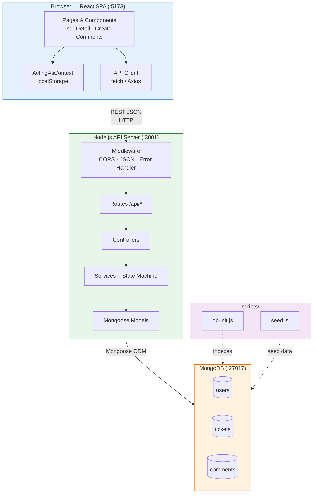
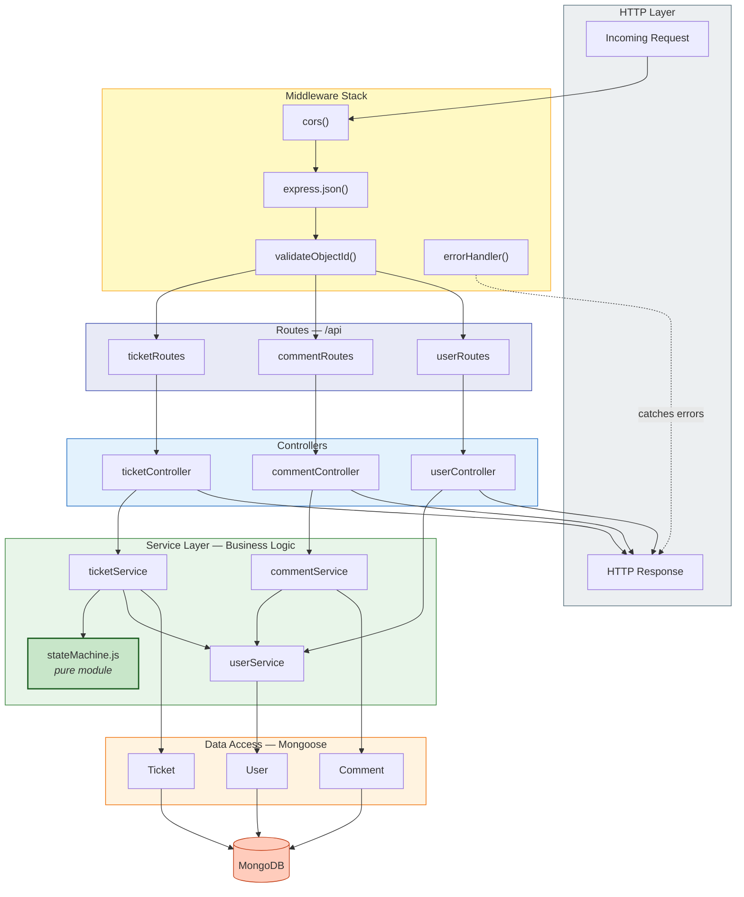
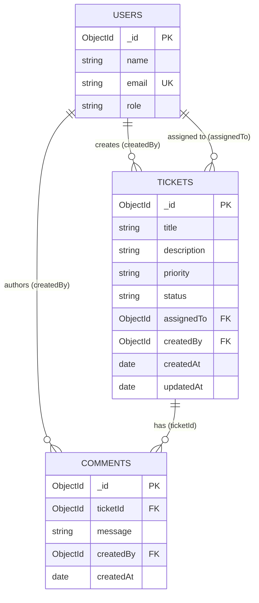
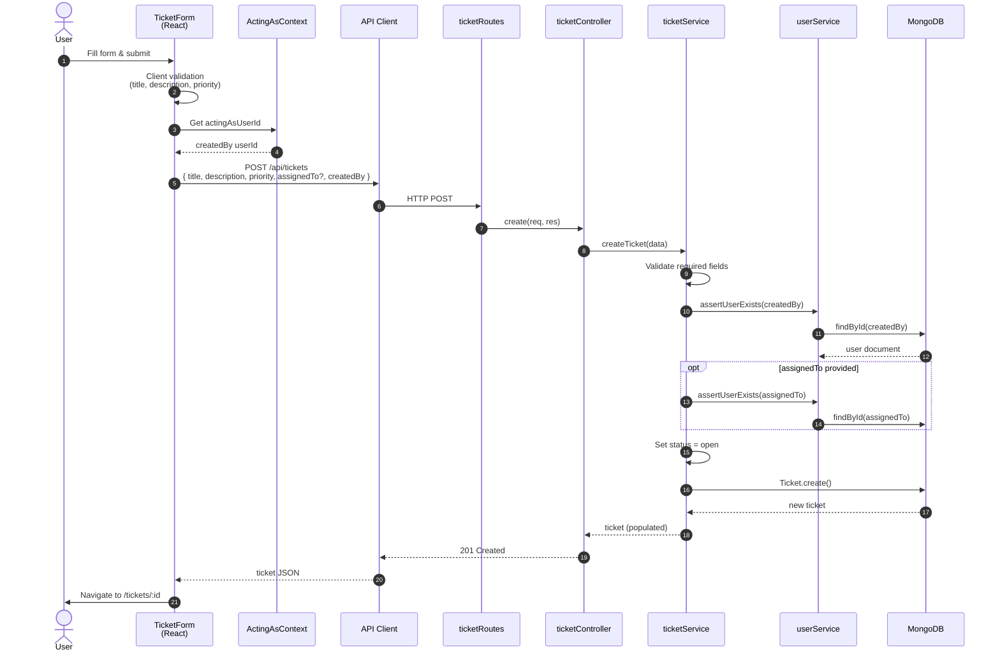
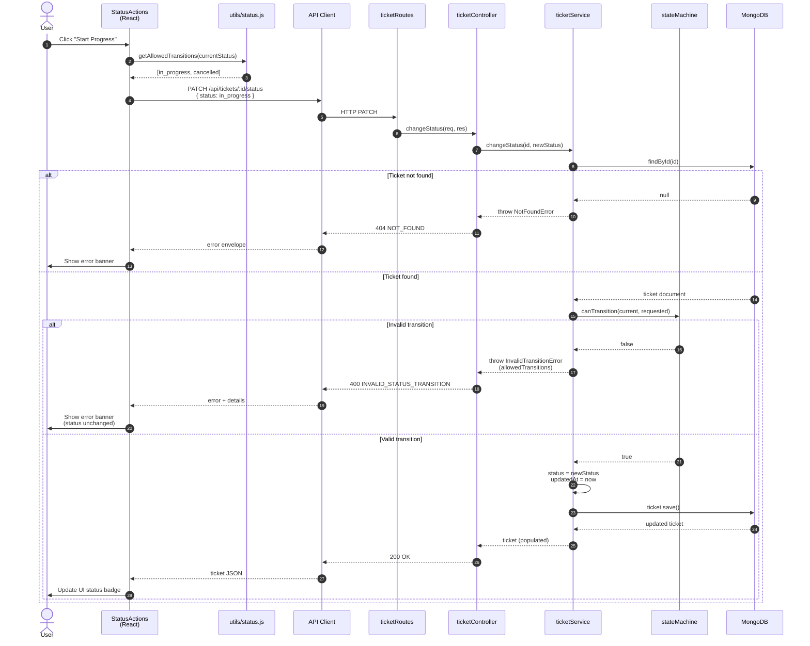
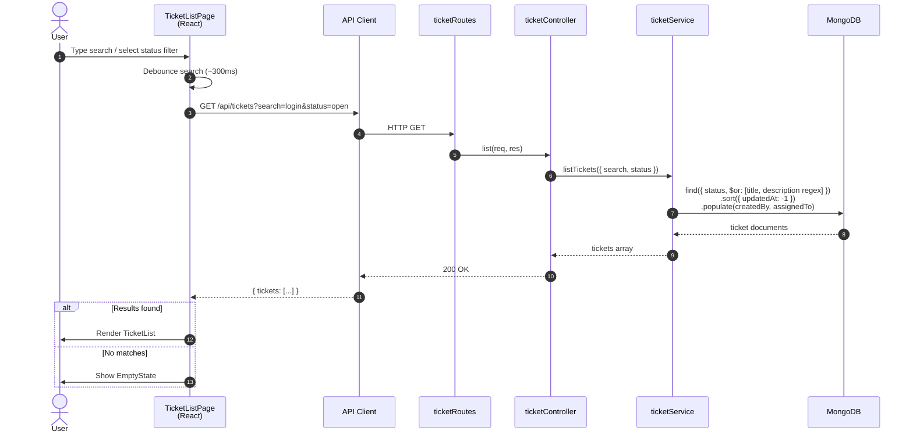
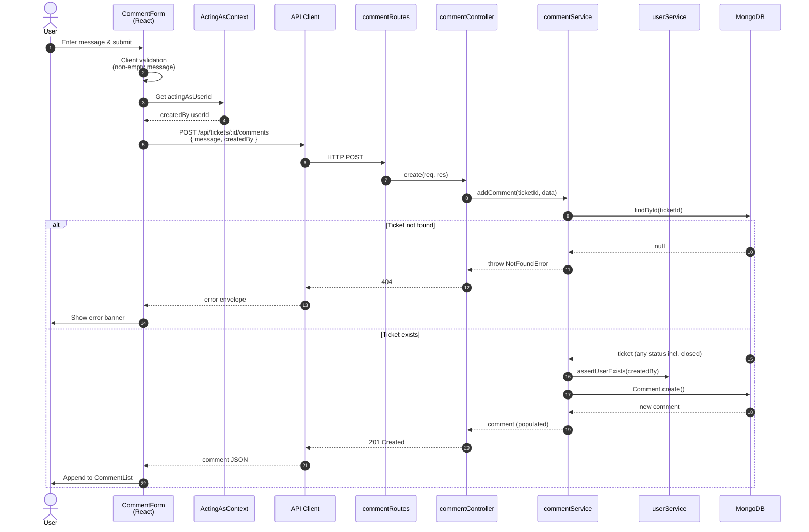
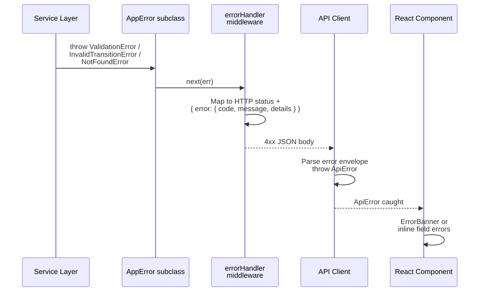

# Architecture Diagrams — Support Ticket Management System

**Document version:** 1.0  
**Date:** 2026-07-11  
**Scope:** Core tier

Visual architecture reference for the Support Ticket Management System. All diagrams use [Mermaid](https://mermaid.js.org/) syntax and render in GitHub, Cursor, and most Markdown viewers.

**Related documents:**

- [`tool-specific/cursor-workflow/spec.md`](tool-specific/cursor-workflow/spec.md) — technical specification
- [`tool-specific/cursor-workflow/project-context.md`](tool-specific/cursor-workflow/project-context.md) — stack and principles
- [`requirements-analysis.md`](requirements-analysis.md) — requirements baseline

---

## 1. System Architecture

Three-tier, client–server architecture. The React SPA communicates exclusively with the Node.js REST API over HTTP/JSON. MongoDB is the system of record. No authentication in Core — users are seeded and selected via an "Acting as" control in the UI.

### Runtime processes (local development)

| Process | Port | Technology |
|---------|------|------------|
| Frontend dev server | 5173 (Vite) or 3000 (CRA) | React SPA |
| Backend API | 3001 | Node.js + Express |
| Database | 27017 | MongoDB |

### Key architectural decisions

- **Backend owns business rules** — validation and state machine enforcement occur server-side.
- **Thin client** — React handles presentation and UX gating only.
- **Dedicated status endpoint** — `PATCH /api/tickets/:id/status` prevents state machine bypass.
- **No auth (Core)** — acting user selected in UI and sent as `createdBy` on writes.

---

## 2. Backend Layer Architecture

Layered monolith with strict dependency direction: routes → controllers → services → models → MongoDB. The state machine is a pure module invoked by `ticketService` — it has no database or HTTP dependencies.

### Layer responsibilities

| Layer | Responsibility | Must not |
|-------|----------------|----------|
| **Middleware** | Cross-cutting HTTP concerns | Contain business logic |
| **Routes** | URL → controller binding | Access database directly |
| **Controllers** | Request/response mapping | Implement state machine rules |
| **Services** | Validation, business rules, orchestration | Use `req` / `res` objects |
| **State machine** | Transition rules (`canTransition`) | Import Mongoose or Express |
| **Models** | Schema, indexes, queries | Application workflow logic |

### API endpoints by route group

| Route group | Endpoints |
|-------------|-----------|
| `ticketRoutes` | `GET/POST /tickets`, `GET/PATCH /tickets/:id`, `PATCH /tickets/:id/status` |
| `commentRoutes` | `POST /tickets/:id/comments` |
| `userRoutes` | `GET /users`, `GET /users/:id` |

---

## 3. Database Entity Relationship Diagram

MongoDB document collections with ObjectId references. Referential integrity is enforced in the **service layer**, not via SQL-style foreign keys.

### Collection details

#### users (seeded — read-only in Core)

| Field | Type | Notes |
|-------|------|-------|
| `_id` | ObjectId | Primary key |
| `name` | string | Display name |
| `email` | string | Unique index |
| `role` | enum | `agent`, `admin`, `viewer` |

#### tickets

| Field | Type | Notes |
|-------|------|-------|
| `_id` | ObjectId | Primary key |
| `title` | string | Required, max 200 |
| `description` | string | Required, max 5000 |
| `priority` | enum | `low`, `medium`, `high`, `critical` |
| `status` | enum | Default `open` |
| `assignedTo` | ObjectId → users | Optional (nullable) |
| `createdBy` | ObjectId → users | Required |
| `createdAt` | Date | Auto |
| `updatedAt` | Date | Auto, refreshed on change |

#### comments

| Field | Type | Notes |
|-------|------|-------|
| `_id` | ObjectId | Primary key |
| `ticketId` | ObjectId → tickets | Required, indexed |
| `message` | string | Required, max 2000 |
| `createdBy` | ObjectId → users | Required |
| `createdAt` | Date | Auto |

### Indexes

| Collection | Index | Purpose |
|------------|-------|---------|
| `users` | `{ email: 1 }` unique | Email uniqueness |
| `tickets` | `{ status: 1 }` | Status filter |
| `tickets` | `{ assignedTo: 1 }` | Assignee queries |
| `tickets` | `{ updatedAt: -1 }` | List sort |
| `comments` | `{ ticketId: 1, createdAt: 1 }` | Comments per ticket |

---

## 4. Ticket Status State Machine

The state machine is the signature judgment piece of Core. Only the transitions shown below are permitted. `closed` and `cancelled` are **terminal states** — no outbound transitions.

```mermaid
stateDiagram-v2
    [*] --> open : Create ticket

    open --> in_progress : Start progress
    open --> cancelled : Cancel

    in_progress --> resolved : Mark resolved
    in_progress --> cancelled : Cancel

    resolved --> closed : Close

    closed --> [*]
    cancelled --> [*]

    note right of open
        Initial status on create.
        Cannot skip to resolved or closed.
    end note

    note right of in_progress
        Cannot revert to open.
        Must resolve before close.
    end note

    note right of closed
        Terminal — no further transitions.
    end note

    note right of cancelled
        Terminal — no further transitions.
    end note
```

### Transition table

| From | Allowed to | Blocked examples |
|------|------------|------------------|
| `open` | `in_progress`, `cancelled` | → `resolved`, → `closed` |
| `in_progress` | `resolved`, `cancelled` | → `open`, → `closed` |
| `resolved` | `closed` | → `open`, → `in_progress`, → `cancelled` |
| `closed` | *(none)* | → any |
| `cancelled` | *(none)* | → any |

### Enforcement points

| Layer | Mechanism |
|-------|-----------|
| **Backend** | `stateMachine.canTransition(from, to)` in `ticketService.changeStatus` |
| **API** | `PATCH /api/tickets/:id/status` only — field update endpoint rejects `status` |
| **Frontend** | `StatusActions` renders buttons from `getAllowedTransitions` (UX only) |
| **Tests** | 11 integration test cases via Supertest (5 valid + 6 invalid) |

### Same-status behavior

Requesting the current status as the target (e.g., `open` → `open`) returns **HTTP 400** — no silent no-op.

---

## 5. Request Flow

### 5.1 Create Ticket

### 5.2 Change Ticket Status (Critical Path)

### 5.3 List Tickets with Search and Filter

### 5.4 Add Comment

### 5.5 Error response flow

All failed API requests follow a consistent path back to the UI:

---

## Diagram Index

| # | Diagram | Type | Section |
|---|---------|------|---------|
| 1 | System Architecture | `flowchart TB` | §1 |
| 2 | Backend Layer Architecture | `flowchart TB` | §2 |
| 3 | Database ERD | `erDiagram` | §3 |
| 4 | Ticket Status State Machine | `stateDiagram-v2` | §4 |
| 5a | Create Ticket | `sequenceDiagram` | §5.1 |
| 5b | Change Status | `sequenceDiagram` | §5.2 |
| 5c | List with Search/Filter | `sequenceDiagram` | §5.3 |
| 5d | Add Comment | `sequenceDiagram` | §5.4 |
| 5e | Error Response | `sequenceDiagram` | §5.5 |

---

*Diagrams reflect Core scope per `spec.md` v1.0. Update this document when architecture changes.*
