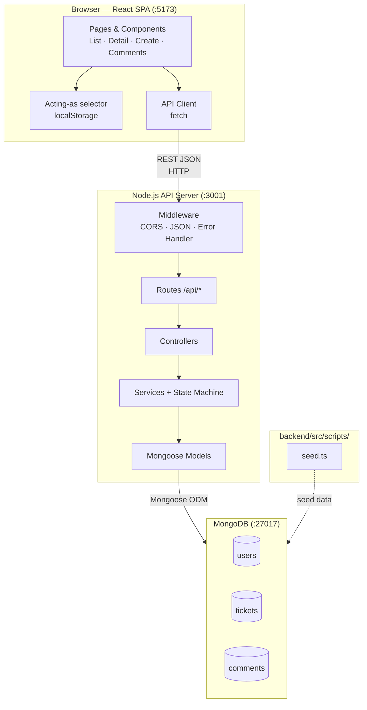
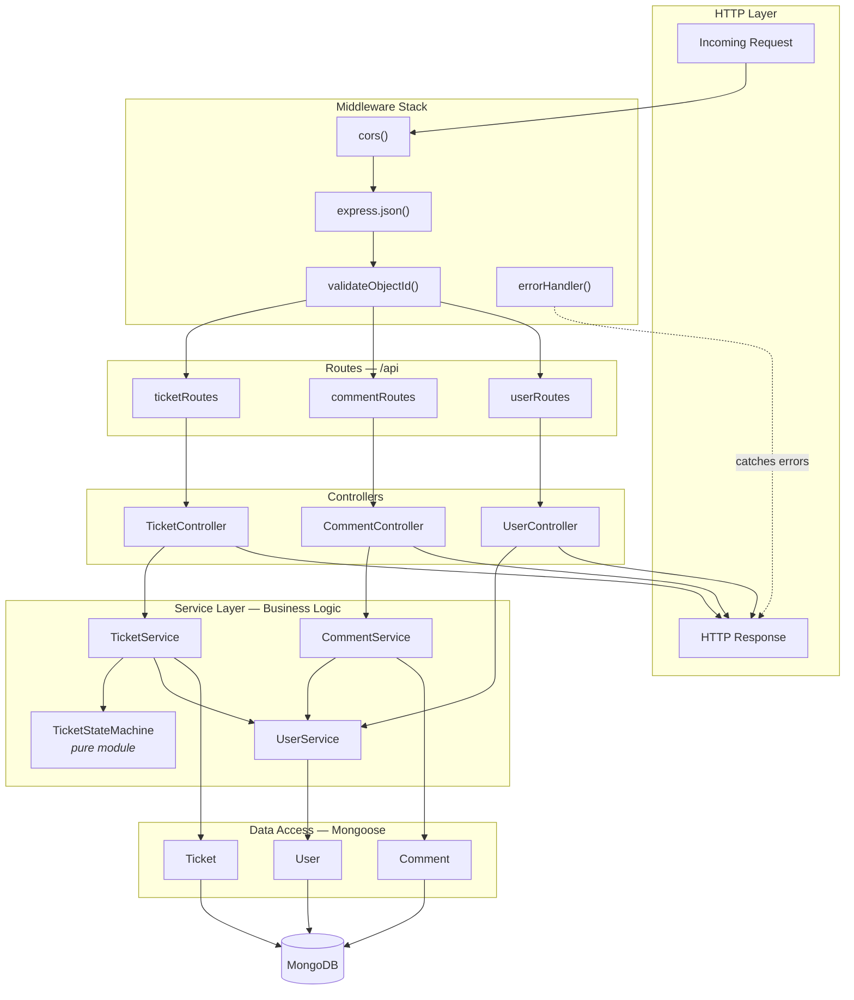
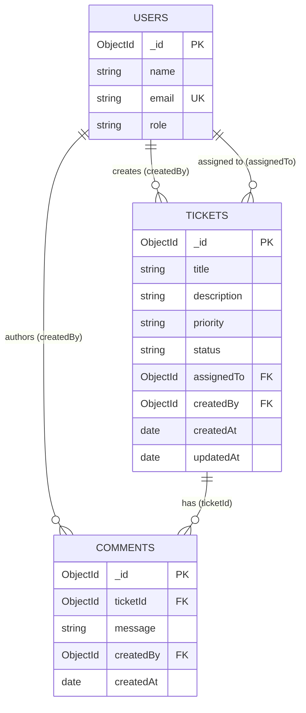
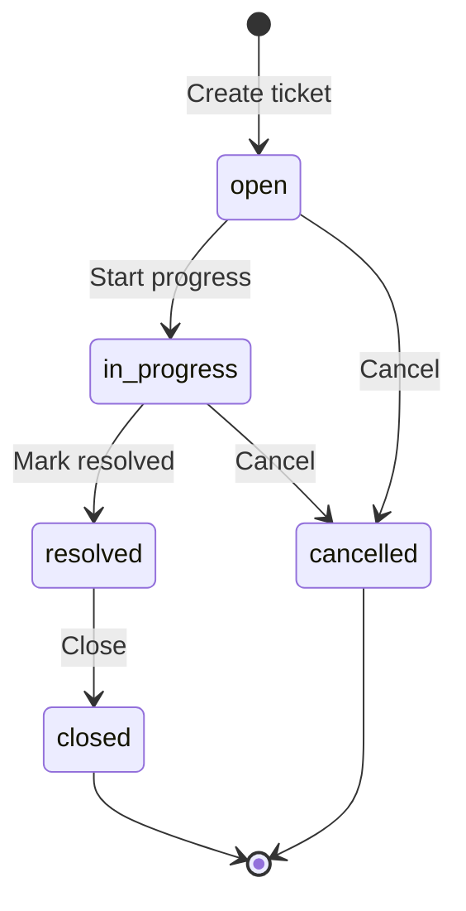

# Architecture

System architecture for the Support Ticket Management System (Core tier). For full design rationale, see [`design-notes.md`](../design-notes.md). For API shapes and data fields, see [`api-contract.md`](../api-contract.md) and [`data-model.md`](../data-model.md).

## 1. System Architecture

Three-tier, client–server architecture. The React SPA communicates exclusively with the Node.js REST API over HTTP/JSON. MongoDB is the system of record. No authentication in Core — users are seeded and selected via an **Acting as** control in the app header.

### Runtime processes (local development)

| Process | Port | Technology |
|---------|------|------------|
| Frontend dev server | 5173 (Vite) | React SPA |
| Backend API | 3001 (configurable via `PORT`) | Node.js + Express |
| Database | 27017 | MongoDB |

### Key architectural decisions

- **Backend owns business rules** — validation and state machine enforcement occur server-side.
- **Thin client** — React handles presentation and UX gating only.
- **Dedicated status endpoint** — `PATCH /api/tickets/:id/status` prevents state machine bypass.
- **No auth (Core)** — acting user selected in the UI and sent as `createdBy` on writes.

---

## 2. Backend Layer Architecture

Layered monolith with strict dependency direction: routes → controllers → services → models → MongoDB. The state machine is a pure module invoked by `TicketService` — it has no database or HTTP dependencies.

### Layer responsibilities

| Layer | Responsibility | Must not |
|-------|----------------|----------|
| **Middleware** | Cross-cutting HTTP concerns | Contain business logic |
| **Routes** | URL → controller binding | Access database directly |
| **Controllers** | Request/response mapping | Implement state machine rules |
| **Services** | Validation, business rules, orchestration | Use `req` / `res` objects |
| **State machine** | Transition rules (`isTransitionAllowed`) | Import Mongoose or Express |
| **Models** | Schema, indexes, queries | Application workflow logic |

### API endpoints by route group

| Route group | Endpoints |
|-------------|-----------|
| `ticketRoutes` | `GET/POST /tickets`, `GET/PATCH /tickets/:id`, `PATCH /tickets/:id/status` |
| `commentRoutes` | `POST /tickets/:id/comments` |
| `userRoutes` | `GET /users`, `GET /users/:id` |

---

## 3. Database Entity Relationship Diagram

MongoDB document collections with ObjectId references. Referential integrity is enforced in the **service layer**, not via SQL-style foreign keys.

---

## 4. Ticket Status State Machine

Only the transitions shown below are permitted. `closed` and `cancelled` are **terminal states** — no outbound transitions.

### Transition table

| From | Allowed to | Blocked examples |
|------|------------|------------------|
| `open` | `in_progress`, `cancelled` | → `resolved`, → `closed` |
| `in_progress` | `resolved`, `cancelled` | → `open`, → `closed` |
| `resolved` | `closed` | → `open`, → `in_progress`, → `cancelled` |
| `closed` | *(none)* | → any |
| `cancelled` | *(none)* | → any |

### Enforcement points

| Layer | Mechanism |
|-------|-----------|
| **Backend** | `TicketStateMachine.changeStatus` in `TicketService.changeStatus` |
| **API** | `PATCH /api/tickets/:id/status` only — field update endpoint rejects `status` |
| **Frontend** | `StatusActions` renders buttons from `allowedTransitions` (UX only) |
| **Tests** | Unit tests on `TicketStateMachine` + integration tests via Supertest |

---

## 5. Request Flow Highlights

### Create ticket

1. User selects acting-as identity in the header (persisted in `localStorage`).
2. `POST /api/tickets` includes `createdBy` from the acting-as user.
3. On success, the UI navigates to `/tickets/:id`.

### Change status

1. `PATCH /api/tickets/:id/status` with the requested status.
2. `TicketService` loads the ticket and calls the state machine.
3. Invalid transitions return `400 INVALID_STATUS_TRANSITION` with `allowedTransitions`.

### Add comment

1. Acting-as user ID is sent as `createdBy` on `POST /api/tickets/:id/comments`.
2. Comments are allowed on tickets in any status, including closed.

---

## Diagram index

| # | Diagram | Type | Section |
|---|---------|------|---------|
| 1 | System Architecture | `flowchart TB` | §1 |
| 2 | Backend Layer Architecture | `flowchart TB` | §2 |
| 3 | Database ERD | `erDiagram` | §3 |
| 4 | Ticket Status State Machine | `stateDiagram-v2` | §4 |

For sequence diagrams (create, status change, list/filter, comments, errors), see **Architecture Diagrams** in [`design-notes.md`](../design-notes.md).

---

*Reflects Core scope per `spec.md`. Update when architecture changes.*
