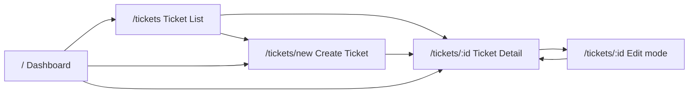
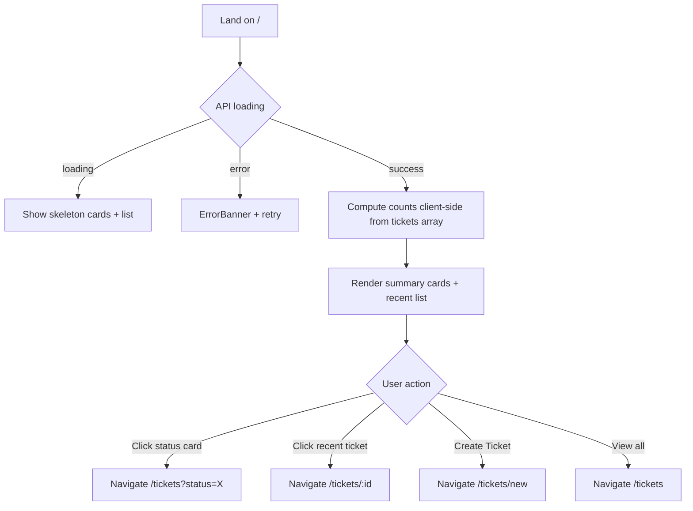
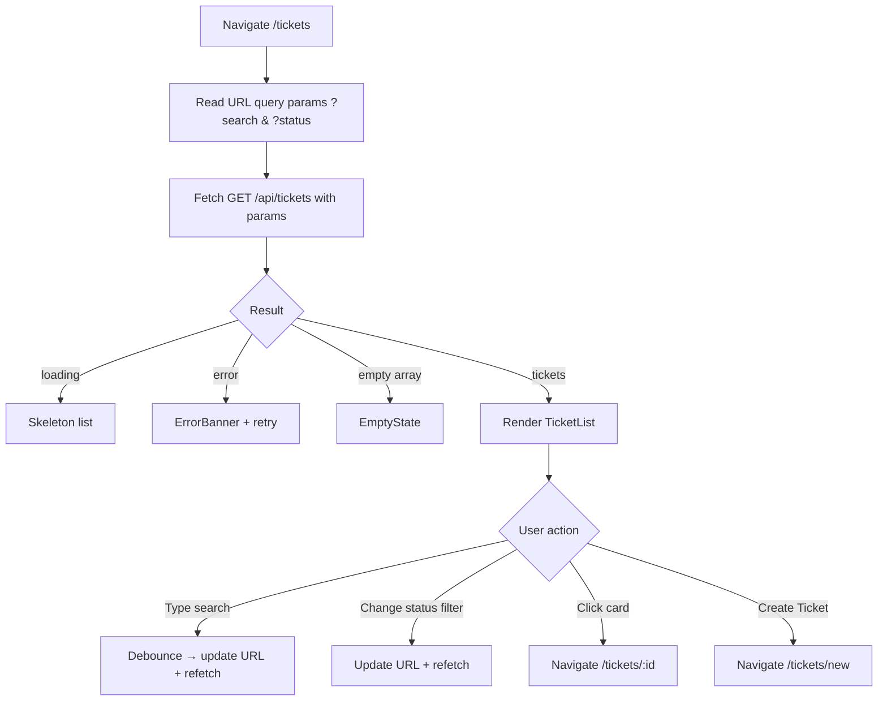
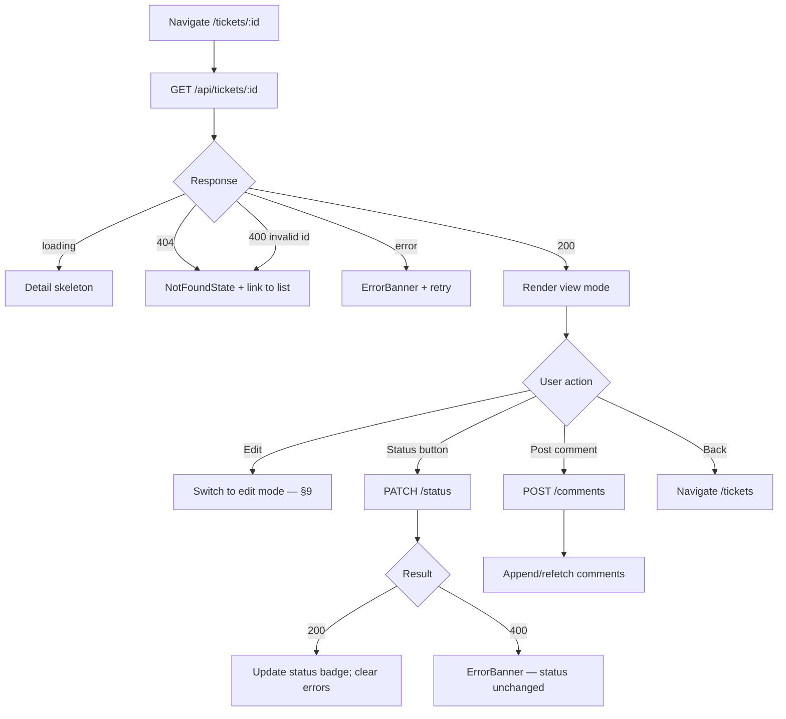
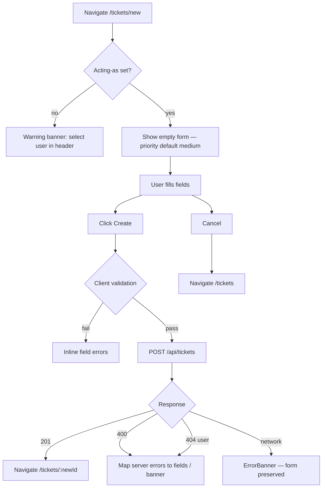
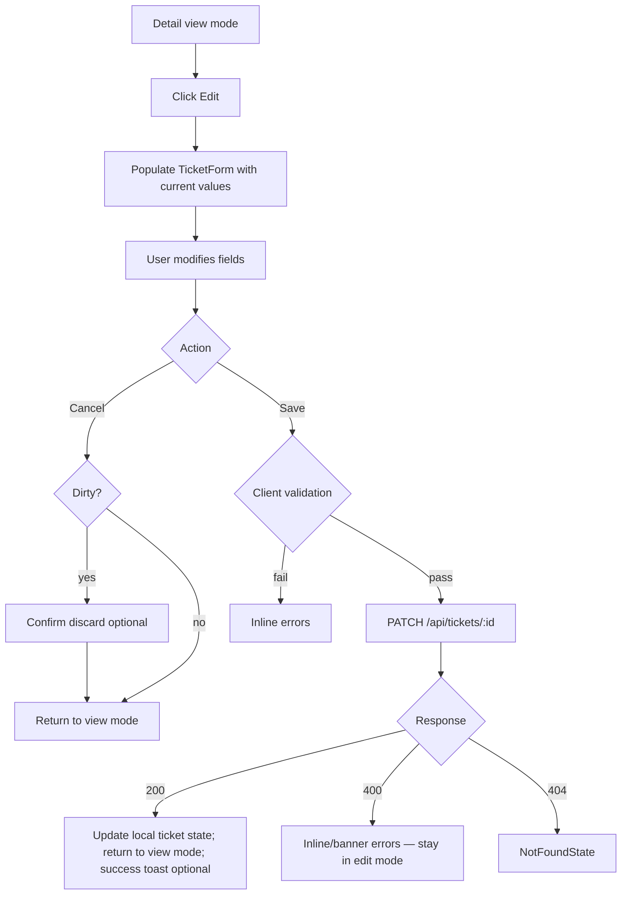

# UI Design — Support Ticket Management System

**Document version:** 1.0  
**Date:** 2026-07-12  
**Stack:** React SPA (Vite + React Router v6)  
**Scope:** Core tier

**Source documents:**

- [`tool-specific/cursor-workflow/spec.md`](tool-specific/cursor-workflow/spec.md) §3
- [`api-design.md`](api-design.md)
- [`architecture.md`](architecture.md)
- [`tool-specific/cursor-workflow/acceptance-criteria.md`](tool-specific/cursor-workflow/acceptance-criteria.md) §2

---

## Table of Contents

1. [Design Principles](#1-design-principles)
2. [Global Layout & Navigation](#2-global-layout--navigation)
3. [Screen Map & Routing](#3-screen-map--routing)
4. [Shared Components](#4-shared-components)
5. [Dashboard](#5-dashboard)
6. [Ticket List](#6-ticket-list)
7. [Ticket Detail](#7-ticket-detail)
8. [Create Ticket](#8-create-ticket)
9. [Edit Ticket](#9-edit-ticket)
10. [Cross-Screen Patterns](#10-cross-screen-patterns)
11. [Accessibility & Responsive Notes](#11-accessibility--responsive-notes)

---

## 1. Design Principles

| Principle | Application |
|-----------|-------------|
| **Clarity over density** | Support agents need status, priority, and assignee visible at a glance |
| **Backend is authoritative** | UI guides actions but always handles API rejection gracefully |
| **No dead ends** | Every screen has loading, error, and empty states with next steps |
| **Acting-as is visible** | User always knows who they are acting as when creating/updating |
| **Minimal Core scope** | No auth UI, no user management, no pagination in Core |
| **Consistent patterns** | Reuse `ErrorBanner`, `EmptyState`, `LoadingSpinner`, badges across screens |

---

## 2. Global Layout & Navigation

### 2.1 App Shell

All screens share a persistent layout:

```
┌────────────────────────────────────────────────────────────────────┐
│  AppHeader                                                         │
│  [Logo] Support Tickets    [Nav]              Acting as: [▼ Jane]  │
├────────────────────────────────────────────────────────────────────┤
│                                                                    │
│                     <main> — page content </main>                  │
│                                                                    │
└────────────────────────────────────────────────────────────────────┘
```

### 2.2 AppHeader Components

| Component | Responsibility |
|-----------|----------------|
| `AppHeader` | Top bar: branding, navigation links, acting-as selector |
| `ActingAsSelector` | Dropdown of seeded users; persists to `localStorage` |
| `NavLinks` | Links: Dashboard, Tickets, Create Ticket |

### 2.3 Navigation Items

| Label | Route | Icon (optional) |
|-------|-------|-----------------|
| Dashboard | `/` | Home |
| Tickets | `/tickets` | List |
| Create Ticket | `/tickets/new` | Plus |

Active route highlighted in nav.

### 2.4 Acting-as Behavior (Global)

| Event | Behavior |
|-------|----------|
| App load | Fetch `GET /api/users`; restore selection from `localStorage` or default to first user |
| User changes selection | Update context + `localStorage`; show name in header |
| Create ticket / comment | `createdBy` = acting-as user ID (not shown as form field) |
| No user selected | Disable create/comment submit; show hint in header |

---

## 3. Screen Map & Routing



| Route | Screen | Primary API |
|-------|--------|-------------|
| `/` | Dashboard | `GET /api/tickets` |
| `/tickets` | Ticket List | `GET /api/tickets?search=&status=` |
| `/tickets/new` | Create Ticket | `POST /api/tickets` |
| `/tickets/:id` | Ticket Detail | `GET /api/tickets/:id` |
| `/tickets/:id` (edit mode) | Edit Ticket | `PATCH /api/tickets/:id` |

**Note:** Edit Ticket is an **inline mode** on the Detail screen (not a separate route), toggled by an "Edit" control. This aligns with spec §3.5 while satisfying the edit screen design requirement.

---

## 4. Shared Components

### 4.1 Component Library

| Component | Used on | Purpose |
|-----------|---------|---------|
| `LoadingSpinner` | All data screens | Centered spinner or skeleton while fetching |
| `ErrorBanner` | All screens | Dismissible or persistent API/transition errors |
| `EmptyState` | List, Dashboard, Comments | Icon + message + optional CTA when no data |
| `StatusBadge` | List, Detail, Dashboard | Color-coded status label |
| `PriorityBadge` | List, Detail, Dashboard | Color-coded priority label |
| `SearchBar` | Ticket List | Debounced keyword input |
| `StatusFilter` | Ticket List | Dropdown: All, Open, In Progress, etc. |
| `TicketCard` | List, Dashboard | Compact ticket summary row/card |
| `TicketForm` | Create, Edit | Shared form fields for ticket metadata |
| `StatusActions` | Detail | Valid transition buttons only |
| `CommentList` | Detail | Chronological comment thread |
| `CommentForm` | Detail | Add comment textarea + submit |
| `TicketMeta` | Detail | Read-only metadata panel (creator, dates) |
| `PageHeader` | All screens | Title + breadcrumb + primary action button |
| `ConfirmDiscardDialog` | Edit | Optional: warn on navigate away with unsaved changes |

### 4.2 Badge Color Guidance

| Status | Color intent | Label |
|--------|--------------|-------|
| `open` | Blue | Open |
| `in_progress` | Amber | In Progress |
| `resolved` | Green | Resolved |
| `closed` | Gray | Closed |
| `cancelled` | Red/muted | Cancelled |

| Priority | Color intent | Label |
|----------|--------------|-------|
| `low` | Gray | Low |
| `medium` | Blue | Medium |
| `high` | Orange | High |
| `critical` | Red | Critical |

### 4.3 Shared Hooks

| Hook | Purpose |
|------|---------|
| `useActingAs()` | Current user from `ActingAsContext` |
| `useUsers()` | Fetch and cache user list for dropdowns |
| `useDebounce(value, 300)` | Search input debouncing |

---

## 5. Dashboard

### 5.1 Purpose

Landing screen providing at-a-glance ticket workload overview. Helps agents see distribution by status and jump to recent or high-priority items without running a search first.

### 5.2 Wireframe

```
┌────────────────────────────────────────────────────────────────────┐
│  Dashboard                                                         │
├────────────────────────────────────────────────────────────────────┤
│  ┌─────────┐ ┌─────────┐ ┌─────────┐ ┌─────────┐ ┌─────────┐   │
│  │ Open    │ │ In Prog │ │ Resolved│ │ Closed  │ │Cancelled│   │
│  │   12    │ │    5    │ │    3    │ │   28    │ │    2    │   │
│  └─────────┘ └─────────┘ └─────────┘ └─────────┘ └─────────┘   │
│       ↑ click navigates to /tickets?status=<status>                │
├────────────────────────────────────────────────────────────────────┤
│  Recent Tickets                          [View all →]              │
│  ┌──────────────────────────────────────────────────────────────┐ │
│  │ [High] Cannot login...        In Progress   Bob    2h ago   │ │
│  │ [Med]  Email delayed...       Open          —      5h ago   │ │
│  │ [Low]  Doc update...          Closed        Jane   1d ago   │ │
│  └──────────────────────────────────────────────────────────────┘ │
├────────────────────────────────────────────────────────────────────┤
│  Quick Actions                                                     │
│  [ + Create Ticket ]    [ View All Tickets ]                       │
└────────────────────────────────────────────────────────────────────┘
```

### 5.3 Components

| Component | Description |
|-----------|-------------|
| `DashboardPage` | Page container; fetches tickets on mount |
| `StatusSummaryCards` | Row of 5 clickable cards — count per status |
| `StatusSummaryCard` | Single status count; links to filtered list |
| `RecentTicketsList` | Last 5 tickets by `updatedAt` desc |
| `QuickActions` | Buttons: Create Ticket, View All Tickets |

### 5.4 User Flow



### 5.5 Data Strategy

| Approach | Detail |
|----------|--------|
| API call | Single `GET /api/tickets` (no filters) on mount |
| Status counts | Client-side `tickets.filter(t => t.status === status).length` |
| Recent list | Sort by `updatedAt` desc; slice first 5 |
| No new endpoint | Dashboard derives metrics from existing list API |

### 5.6 Validation

No form input on Dashboard. No client validation required.

### 5.7 Error Handling

| Scenario | UI response |
|----------|-------------|
| `GET /api/tickets` fails | Full-page `ErrorBanner`: "Unable to load dashboard data." + **Retry** button |
| Partial render failure | Unlikely; single API call |

### 5.8 Loading State

| Element | Loading behavior |
|---------|------------------|
| Summary cards | 5 skeleton rectangles (pulse animation) |
| Recent list | 3 skeleton `TicketCard` rows |
| Quick actions | Visible but disabled until load completes (optional) |

### 5.9 Empty State

| Condition | Message | CTA |
|-----------|---------|-----|
| Zero tickets in system | "No tickets yet. Create your first support ticket to get started." | **Create Ticket** → `/tickets/new` |
| Recent list empty (but counts exist) | "No recent activity." | **View All Tickets** |

---

## 6. Ticket List

### 6.1 Purpose

Primary work queue — browse, search, and filter all tickets. Entry point for detail view and ticket creation.

### 6.2 Wireframe

```
┌────────────────────────────────────────────────────────────────────┐
│  Tickets                                    [ + Create Ticket ]    │
├────────────────────────────────────────────────────────────────────┤
│  [ 🔍 Search tickets...          ]  [ Status: All ▼ ]  [ Clear ]   │
├────────────────────────────────────────────────────────────────────┤
│  ┌──────────────────────────────────────────────────────────────┐ │
│  │ Cannot login to dashboard                                     │ │
│  │ [Open] [High]  Assigned: Bob Admin  Updated: 2 hours ago     │ │
│  └──────────────────────────────────────────────────────────────┘ │
│  ┌──────────────────────────────────────────────────────────────┐ │
│  │ Email notifications delayed                                   │ │
│  │ [In Progress] [Medium]  Assigned: Jane  Updated: 5 hours ago │ │
│  └──────────────────────────────────────────────────────────────┘ │
│  ...                                                              │
└────────────────────────────────────────────────────────────────────┘
```

### 6.3 Components

| Component | Description |
|-----------|-------------|
| `TicketListPage` | Page shell; manages search/filter state and API calls |
| `PageHeader` | Title "Tickets" + Create button |
| `SearchBar` | Controlled input; debounced 300ms |
| `StatusFilter` | Select: All, Open, In Progress, Resolved, Closed, Cancelled |
| `FilterClearButton` | Resets search + status (shown when filters active) |
| `TicketList` | Maps tickets array to `TicketCard` components |
| `TicketCard` | Clickable card: title, badges, assignee, relative updated time |

### 6.4 User Flow



### 6.5 URL State (Recommended)

Sync filters to query string for shareable/bookmarkable views:

| Param | Example | Maps to |
|-------|---------|---------|
| `search` | `login` | `SearchBar` value |
| `status` | `open` | `StatusFilter` value |

Dashboard status card links use this: `/tickets?status=open`.

### 6.6 Validation

| Input | Client rule |
|-------|-------------|
| `search` | No min length; empty clears filter |
| `status` | Must be valid enum or "all" (omit param) |

Invalid status from URL → ignore or reset to "all" (no error banner).

### 6.7 Error Handling

| Scenario | UI response |
|----------|-------------|
| List fetch fails | `ErrorBanner` above list area: "Failed to load tickets." + **Retry** |
| Invalid API error on filter | `ErrorBanner` with server message (e.g., invalid status) |
| Network offline | "Unable to reach server. Check your connection." |

### 6.8 Loading State

| Scenario | Behavior |
|----------|----------|
| Initial load | 5–8 skeleton `TicketCard` placeholders |
| Filter/search change | Inline spinner on filter bar OR skeleton refresh (avoid flicker: keep previous results dimmed optional) |
| Retry | Full skeleton on refetch |

### 6.9 Empty States

| Condition | Title | Message | CTA |
|-----------|-------|---------|-----|
| No tickets in DB | No tickets yet | "There are no support tickets in the system." | **Create Ticket** |
| No search/filter matches | No results found | "No tickets match your search. Try different keywords or clear filters." | **Clear filters** |
| Filter by status — none | No {status} tickets | "No tickets with status '{label}'." | **Clear filter** or **Create Ticket** |

---

## 7. Ticket Detail

### 7.1 Purpose

Single ticket workspace — view full details, change status, read/add comments, and enter edit mode for metadata.

### 7.2 Wireframe (View Mode)

```
┌────────────────────────────────────────────────────────────────────┐
│  ← Back to Tickets                                                 │
├────────────────────────────────────────────────────────────────────┤
│  Cannot login to dashboard              [ Edit ]                   │
│  [Open]  [High]                                                    │
├──────────────────────────────┬─────────────────────────────────────┤
│  Description                 │  Details                            │
│  User reports 500 error...   │  Assignee: Bob Admin              │
│                              │  Created by: Jane Agent             │
│  Status Actions              │  Created: Jul 10, 2026 10:00 AM     │
│  [ Start Progress ] [ Cancel ] │  Updated: Jul 10, 2026 10:00 AM   │
├──────────────────────────────┴─────────────────────────────────────┤
│  Comments (2)                                                      │
│  ┌──────────────────────────────────────────────────────────────┐ │
│  │ Jane Agent · Jul 10, 11:00 AM                                 │ │
│  │ Reproduced in Chrome.                                         │ │
│  └──────────────────────────────────────────────────────────────┘ │
│  ┌──────────────────────────────────────────────────────────────┐ │
│  │ [ Add a comment...                                    ] [Post]│ │
│  └──────────────────────────────────────────────────────────────┘ │
└────────────────────────────────────────────────────────────────────┘
```

### 7.3 Components

| Component | Description |
|-----------|-------------|
| `TicketDetailPage` | Page container; fetch ticket + comments; mode state (view/edit) |
| `BackLink` | Navigate to `/tickets` (preserve filters if possible) |
| `TicketDetailHeader` | Title, status badge, priority badge, Edit button |
| `TicketDescription` | Read-only description text (view mode) |
| `TicketMeta` | Sidebar/panel: assignee, creator, timestamps |
| `StatusActions` | Transition buttons per `getAllowedTransitions(status)` |
| `CommentList` | Ordered comments with author + formatted date |
| `CommentForm` | Textarea + Post button |
| `NotFoundState` | 404 — ticket doesn't exist |

### 7.4 Status Actions by State

| Current status | Buttons shown | API call on click |
|----------------|---------------|-------------------|
| `open` | Start Progress, Cancel | `PATCH .../status` → `in_progress` / `cancelled` |
| `in_progress` | Mark Resolved, Cancel | → `resolved` / `cancelled` |
| `resolved` | Close | → `closed` |
| `closed` | *(none)* | — |
| `cancelled` | *(none)* | — |

Button labels use action verbs; underlying enum sent in API body.

### 7.5 User Flow



### 7.6 Validation

| Action | Client validation |
|--------|-------------------|
| Status change | Button only shown for allowed transitions (pre-check) |
| Comment | Non-empty message after trim before submit |

### 7.7 Error Handling

| Scenario | UI response |
|----------|-------------|
| Ticket not found (404) | `NotFoundState`: "Ticket not found." + **Back to Tickets** |
| Invalid ticket ID (400) | Same as not found |
| Fetch error (500/network) | `ErrorBanner` + **Retry** |
| Invalid transition (400) | `ErrorBanner` with server `message`; display `allowedTransitions` if helpful |
| Comment post fails | `ErrorBanner` above comment form; preserve textarea content |
| Acting-as not set | Disable comment Post; tooltip: "Select who you are acting as" |

### 7.8 Loading State

| Element | Behavior |
|---------|----------|
| Full page initial load | Skeleton: title bar, description block, meta panel, 2 comment placeholders |
| Status transition in progress | Disable all `StatusActions` buttons; spinner on clicked button |
| Comment submitting | Disable Post button; spinner on button |
| Refetch after mutation | Brief inline refresh acceptable; avoid full-page flash |

### 7.9 Empty States

| Area | Condition | Message |
|------|-----------|---------|
| Comments | `comments.length === 0` | "No comments yet. Be the first to add one." |
| Status actions | Terminal status | No buttons; optional info text: "This ticket is closed." / "...cancelled." |
| Assignee | `assignedTo === null` | Display "Unassigned" in meta panel |

---

## 8. Create Ticket

### 8.1 Purpose

Form to submit a new support ticket. Creator is inferred from acting-as context.

### 8.2 Wireframe

```
┌────────────────────────────────────────────────────────────────────┐
│  ← Back to Tickets                                                 │
│  Create Ticket                                                     │
│  Creating as: Jane Agent                                           │
├────────────────────────────────────────────────────────────────────┤
│  Title *                                                           │
│  [                                                    ]            │
│                                                                    │
│  Description *                                                     │
│  [                                                    ]            │
│  [                                                    ]            │
│                                                                    │
│  Priority *                                                        │
│  ( ) Low  (•) Medium  ( ) High  ( ) Critical                       │
│                                                                    │
│  Assignee                                                          │
│  [ Select assignee (optional)  ▼ ]                                 │
│                                                                    │
│                              [ Cancel ]  [ Create Ticket ]         │
└────────────────────────────────────────────────────────────────────┘
```

### 8.3 Components

| Component | Description |
|-----------|-------------|
| `CreateTicketPage` | Page shell |
| `PageHeader` | Title + back link |
| `ActingAsHint` | Read-only line: "Creating as: {name}" |
| `TicketForm` | Shared form — `mode="create"` |
| `FormField` | Label + input + inline error |
| `PrioritySelector` | Radio group or select |
| `AssigneeSelect` | Optional dropdown from `GET /api/users` |
| `FormActions` | Cancel + Submit buttons |

### 8.4 User Flow



### 8.5 Form Fields

| Field | Required | Default | Control |
|-------|----------|---------|---------|
| `title` | Yes | — | Text input, max 200 |
| `description` | Yes | — | Textarea, max 5000 |
| `priority` | Yes | `medium` | Radio or select |
| `assignedTo` | No | empty | User dropdown + "Unassigned" option |
| `createdBy` | Auto | acting-as user | Hidden — not editable |

### 8.6 Validation

| Field | Client rule | On fail |
|-------|-------------|---------|
| `title` | Required; trim; 1–200 chars | Inline: "Title is required" |
| `description` | Required; trim; 1–5000 chars | Inline: "Description is required" |
| `priority` | Must be selected (default satisfies) | — |
| `assignedTo` | Optional | — |
| Acting-as | Must be set before submit | Banner: "Select who you are acting as in the header" |

**On submit:** validate all fields; focus first invalid field.

**Server errors (400):** map `details.fields` from API to inline errors if present; else `ErrorBanner`.

### 8.7 Error Handling

| Scenario | UI response |
|----------|-------------|
| Validation failure (client) | Inline errors; no API call |
| Validation failure (server 400) | Inline field errors or `ErrorBanner` |
| User not found (404) | `ErrorBanner`: "Selected user no longer exists." |
| Network error | `ErrorBanner`; form values preserved |
| Acting-as missing | Disable submit button + banner |

### 8.8 Loading State

| Scenario | Behavior |
|----------|----------|
| Page load | Form visible immediately (users loaded in background for assignee dropdown) |
| Users loading | Assignee dropdown disabled with "Loading users..." |
| Submit in progress | Disable form fields; spinner on **Create Ticket** button; label → "Creating..." |

### 8.9 Empty States

Create screen has no list empty state. **Assignee dropdown** includes explicit option: "Unassigned" (sends `null`/omits field).

---

## 9. Edit Ticket

### 9.1 Purpose

Update ticket metadata (title, description, priority, assignee) without changing status. Implemented as **edit mode** on the Detail screen — not a separate route.

### 9.2 Wireframe (Edit Mode)

```
┌────────────────────────────────────────────────────────────────────┐
│  ← Back to Tickets                                                 │
│  Edit Ticket                                                       │
│  [Open]  [High]                         (status read-only)         │
├────────────────────────────────────────────────────────────────────┤
│  Title *                                                           │
│  [ Cannot login to dashboard                         ]             │
│                                                                    │
│  Description *                                                     │
│  [ User reports 500 error...                         ]             │
│                                                                    │
│  Priority *                                                        │
│  ( ) Low  ( ) Medium  (•) High  ( ) Critical                       │
│                                                                    │
│  Assignee                                                          │
│  [ Bob Admin  ▼ ]                                                  │
│                                                                    │
│  Status changes use the action buttons below (view mode).          │
│                                                                    │
│                              [ Cancel ]  [ Save Changes ]          │
├────────────────────────────────────────────────────────────────────┤
│  (Comments section remains visible but collapsed or read-only)     │
└────────────────────────────────────────────────────────────────────┘
```

### 9.3 Components

| Component | Description |
|-----------|-------------|
| `TicketDetailPage` | Toggles `mode: 'view' \| 'edit'` |
| `TicketForm` | Shared form — `mode="edit"` with initial values from ticket |
| `ReadOnlyStatusBar` | Status badge fixed in edit mode — not editable |
| `UnsavedChangesGuard` | Optional: prompt if navigating away with dirty form |

**Reuse:** `TicketForm`, `PrioritySelector`, `AssigneeSelect`, `FormField`, `FormActions` from Create screen.

### 9.4 User Flow



### 9.5 Editable vs Read-Only in Edit Mode

| Field | Editable | Notes |
|-------|----------|-------|
| `title` | Yes | |
| `description` | Yes | |
| `priority` | Yes | |
| `assignedTo` | Yes | Include Unassigned |
| `status` | **No** | Use `StatusActions` in view mode only |
| `createdBy` | No | Display in meta panel only |
| `createdAt` / `updatedAt` | No | Display only; `updatedAt` changes after save |

**Terminal tickets (`closed`, `cancelled`):** metadata remains editable per DD-04; status actions hidden.

### 9.6 Validation

Same rules as Create Ticket for `title`, `description`, `priority`, `assignedTo`.

| Additional rule | Detail |
|-----------------|--------|
| At least one field changed | Optional: disable Save if form is pristine |
| `status` in payload | Not sent — UI must not include status field |

### 9.7 Error Handling

| Scenario | UI response |
|----------|-------------|
| Client validation fail | Inline errors; remain in edit mode |
| Server 400 | Map field errors; remain in edit mode |
| `STATUS_UPDATE_NOT_ALLOWED` | Should not occur — status not in form |
| 404 on save | `NotFoundState` — ticket deleted externally |
| Network error | `ErrorBanner`; form values preserved |

### 9.8 Loading State

| Scenario | Behavior |
|----------|----------|
| Enter edit mode | Instant — uses already-loaded ticket data |
| Save in progress | Disable form; spinner on **Save Changes**; label → "Saving..." |
| Users dropdown | Uses cached users from context; load if missing |

### 9.9 Empty States

Not applicable for edit form. If ticket failed to load, user cannot enter edit mode.

---

## 10. Cross-Screen Patterns

### 10.1 State Matrix

| Screen | Loading | Error | Empty |
|--------|---------|-------|-------|
| Dashboard | Skeleton cards + list | Banner + retry | No tickets CTA |
| Ticket List | Skeleton cards | Banner + retry | No tickets / no results |
| Ticket Detail | Skeleton layout | Banner + retry / 404 | No comments |
| Create Ticket | Submit button spinner | Inline + banner | — |
| Edit Ticket | Save button spinner | Inline + banner | — |

### 10.2 ErrorBanner Specification

| Property | Value |
|----------|-------|
| Placement | Top of `<main>`, below page header |
| Content | Server `error.message` or friendly fallback |
| Dismiss | Manual dismiss (×) for non-blocking errors |
| Persistence | Transition errors persist until next action or dismiss |
| Role | `role="alert"` for screen readers |

### 10.3 LoadingSpinner Specification

| Property | Value |
|----------|-------|
| Types | Full-page centered spinner OR skeleton placeholders |
| Preference | Skeleton for list/detail; spinner for button inline actions |
| Accessibility | `aria-busy="true"` on loading container; `aria-live="polite"` |

### 10.4 EmptyState Specification

| Property | Value |
|----------|-------|
| Structure | Icon/visual + heading + description + optional CTA button |
| Tone | Helpful, not alarming |
| CTA | Primary button links to corrective action |

### 10.5 Form Validation Timing

| Timing | Behavior |
|--------|----------|
| On submit | Validate all required fields (Create, Edit, Comment) |
| On blur (optional) | Validate individual field — recommended for title/description |
| After server error | Show server messages; do not clear user input |

### 10.6 Success Feedback

| Action | Feedback |
|--------|----------|
| Create ticket | Navigate to detail (implicit success) |
| Save edit | Return to view mode; optionally brief "Saved" message |
| Status change | Update badge in place |
| Add comment | Comment appears in list; clear textarea |

No modal dialogs required for Core success paths.

### 10.7 Comment Form (on Detail)

Included on Detail screen; documented here for completeness.

| Aspect | Specification |
|--------|---------------|
| Placement | Below `CommentList` |
| Fields | `message` textarea only |
| Validation | Non-empty after trim |
| Submit | `POST /api/tickets/:id/comments` with `createdBy` from acting-as |
| Loading | Disable Post + spinner |
| Error | Banner above form; preserve text |
| Empty list | `CommentList` shows empty state (§7.9) |

---

## 11. Accessibility & Responsive Notes

### 11.1 Accessibility (Core — Should)

| Requirement | Implementation |
|-------------|----------------|
| Form labels | Every input has `<label htmlFor>` or `aria-label` |
| Buttons | Descriptive text: "Start Progress" not just "Submit" |
| Status badges | Include text labels, not color alone |
| Focus management | Focus first error field on validation fail |
| Keyboard | All actions reachable via keyboard |
| Alerts | `role="alert"` on `ErrorBanner` |

### 11.2 Responsive Layout (Core — Light)

| Breakpoint | Behavior |
|------------|----------|
| Desktop (≥768px) | Detail: two-column (content + meta sidebar) |
| Mobile (<768px) | Detail: single column stack; meta below description |
| List | Cards full width at all sizes |

### 11.3 File Structure (planned)

```
client/src/pages/
├── DashboardPage.jsx
├── TicketListPage.jsx
├── TicketDetailPage.jsx    # view + edit modes
└── CreateTicketPage.jsx
```

---

## Appendix A — Screen-to-API Matrix

| Screen | API calls |
|--------|-----------|
| Dashboard | `GET /api/tickets` |
| Ticket List | `GET /api/tickets?search=&status=` |
| Ticket Detail (load) | `GET /api/tickets/:id` |
| Ticket Detail (status) | `PATCH /api/tickets/:id/status` |
| Ticket Detail (comment) | `POST /api/tickets/:id/comments` |
| Create Ticket | `POST /api/tickets` |
| Edit Ticket | `PATCH /api/tickets/:id` |
| Global (users) | `GET /api/users` |

---

## Appendix B — Acceptance Criteria Traceability

| Screen | FE criteria |
|--------|-------------|
| Dashboard | FE-40 (loading/error/empty) |
| Ticket List | FE-01, FE-06–FE-11, FE-38, FE-39 |
| Ticket Detail | FE-03, FE-18, FE-22, FE-23, FE-24–FE-30, FE-31–FE-34 |
| Create Ticket | FE-02, FE-12–FE-17, FE-15 |
| Edit Ticket | FE-19, FE-20, FE-21 |

---

*This document is the UI design baseline for frontend implementation. Components and flows must align with [`api-design.md`](api-design.md) and [`tool-specific/cursor-workflow/spec.md`](tool-specific/cursor-workflow/spec.md).*
