# Test Results

## Test Environment

| Item           | Value                                                                                                                                   |
| -------------- | --------------------------------------------------------------------------------------------------------------------------------------- |
| Node.js        | 18+ required (20+ recommended for frontend Vitest)                                                                                      |
| Backend        | Node.js + Express + TypeScript                                                                                                          |
| Frontend       | React + Vite + TypeScript                                                                                                               |
| Database       | MongoDB                                                                                                                                 |
| Testing Method | Manual UI verification, Manual API verification (browser/Postman), Integration tests (Vitest + Supertest), Frontend unit tests (Vitest) |
| Test Date      | 20 July 2026                                                                                                                            |

---

# Frontend UI Verification

Manual verification of the React SPA against acceptance criteria. Screenshots captured from `http://localhost:5173` with backend running on port 5000.

| Screen | Scenario | Screenshot | Status |
|--------|----------|------------|--------|
| Dashboard (desktop) | Ticket stats grid and recent tickets | `desktop-view/desktop-view-dashboard.png` | ✅ Pass |
| Dashboard (mobile) | Responsive dashboard layout | `mobile-view/mobile-view-dashboard.png` | ✅ Pass |
| Ticket list (desktop) | Table with title, priority, status, assignee | `desktop-view/desktop-view-ticket-listing.png` | ✅ Pass |
| Ticket list (mobile) | Responsive ticket list layout | `mobile-view/mobile-view-ticket-listing.png` | ✅ Pass |
| Ticket filtering (desktop) | Search and combined filters | `desktop-view/desktop-view-ticket-filtering.png` | ✅ Pass |
| Filter by status (desktop) | URL-synced status filter | `desktop-view/desktop-view-ticket-filter-by-status.png` | ✅ Pass |
| Filter by priority (desktop) | Priority filter applied | `desktop-view/desktop-view-ticket-filter-by-priority.png` | ✅ Pass |
| Filter by user (desktop) | Assigned-user filter applied | `desktop-view/desktop-view-ticket-filter-by-user.png` | ✅ Pass |
| Create ticket (desktop) | Form with validation; acting-as selector in header | `desktop-view/desktop-view-ticket-creation.png` | ✅ Pass |
| Create ticket (mobile) | Responsive create ticket form | `mobile-view/mobile-view-ticket-creation.png` | ✅ Pass |
| Ticket detail (desktop) | Detail view with metadata and comments | Manual verification (see § Acting-as) | ✅ Pass |
| Status workflow (desktop) | Allowed transitions and status timeline | Manual verification on detail page | ✅ Pass |
| Edit ticket (desktop) | Edit form for title, description, priority, assignee | `desktop-view/desktop-view-edit-ticket.png` | ✅ Pass |

### Desktop — Dashboard

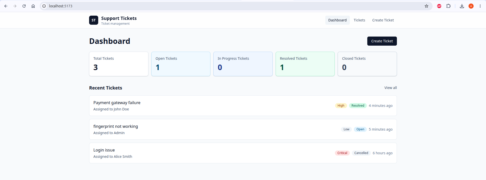

### Desktop — Ticket List

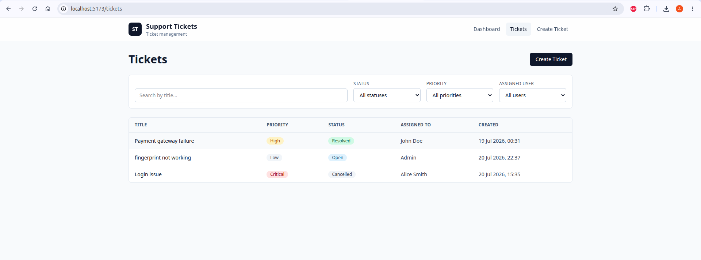

### Desktop — Ticket Filtering

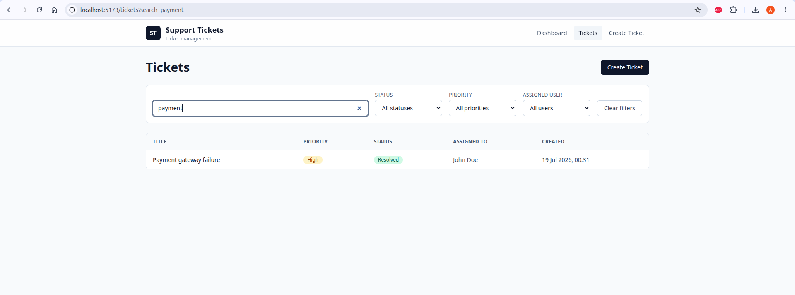

### Desktop — Filter by Status

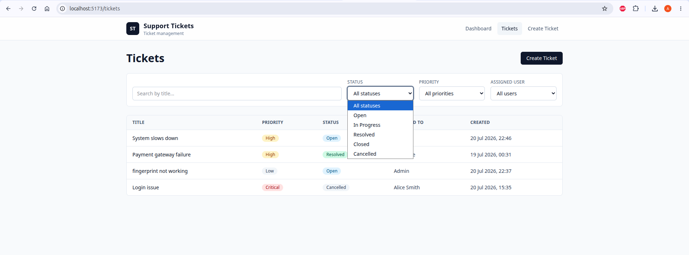

### Desktop — Filter by Priority

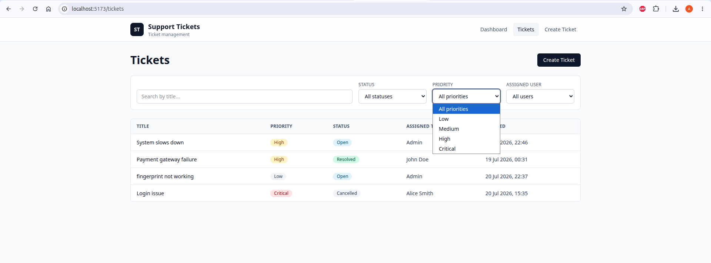

### Desktop — Filter by Assigned User

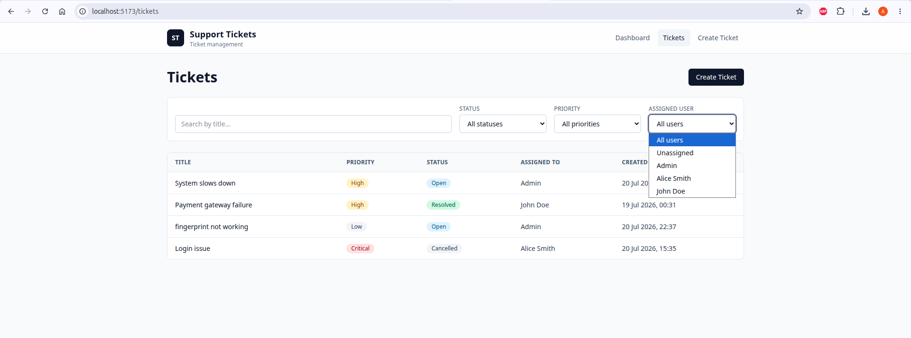

### Desktop — Create Ticket

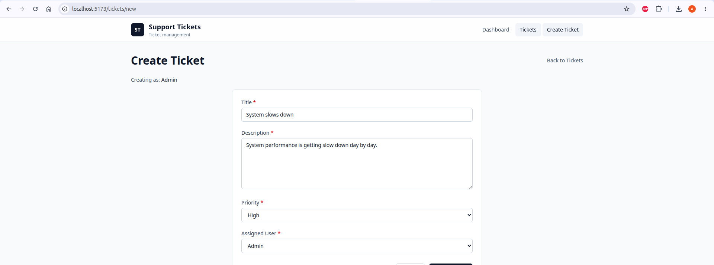

### Mobile — Dashboard

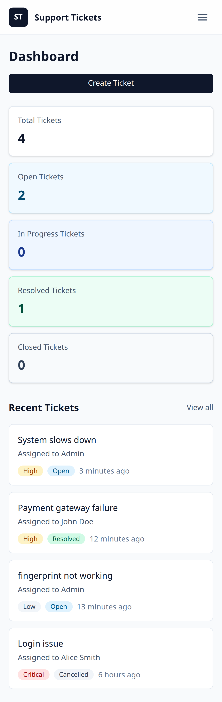

### Mobile — Ticket List

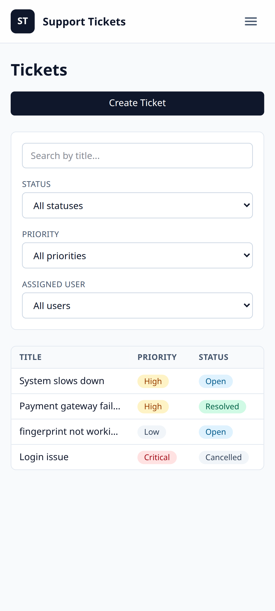

### Mobile — Create Ticket

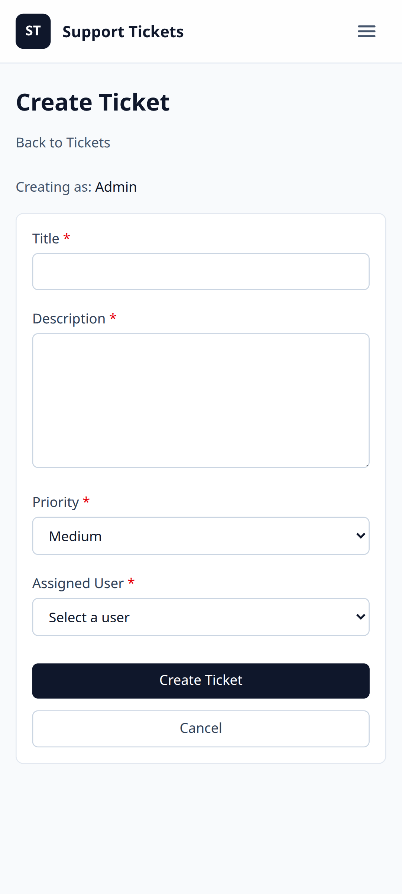

### Desktop — Edit Ticket

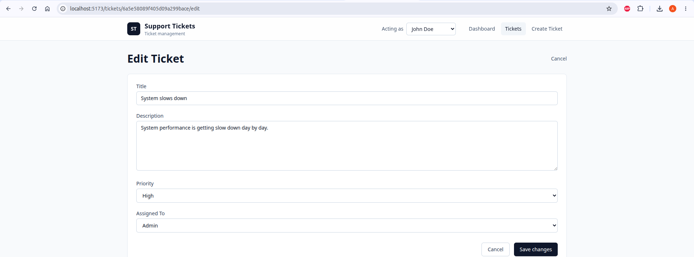

> **Optional:** Capture ticket detail and status workflow screenshots with the dev stack running: `node scripts/capture-screenshots.mjs` (requires `npx playwright install chromium`).

---

## Acting-as verification (TEST-17)

| Step | Expected | Result | Status |
|------|----------|--------|--------|
| Open header **Acting as** selector | Lists seeded users from `GET /api/users` | User dropdown populated | ✅ Pass |
| Select a different user | Selection persists after page refresh | `localStorage` key `actingAsUserId` updated | ✅ Pass |
| Create ticket while acting as User B | `POST /api/tickets` sends `createdBy: User B` | Ticket detail shows User B as creator | ✅ Pass |
| Add comment while acting as User B | `POST /comments` sends `createdBy: User B` | Comment author shows User B | ✅ Pass |

---

# API Verification Results

| Endpoint                    | Scenario                      | Expected Result           | Actual Result               | Status |
| --------------------------- | ----------------------------- | ------------------------- | --------------------------- | ------ |
| GET /health                 | Check server health           | 200 OK                    | 200 OK                      | ✅ Pass |
| GET /users                  | Retrieve seeded users         | Seed users returned       | Seed users returned         | ✅ Pass |
| POST /tickets               | Create ticket with valid data | Ticket created            | Ticket created successfully | ✅ Pass |
| GET /tickets                | Retrieve all tickets          | Ticket list returned      | Ticket list returned        | ✅ Pass |
| GET /tickets/:id            | Retrieve ticket details       | Ticket returned           | Correct ticket returned     | ✅ Pass |
| PATCH /tickets/:id          | Update ticket details         | Ticket updated            | Ticket updated successfully | ✅ Pass |
| PATCH /tickets/:id/status   | Valid status transition       | Status updated            | Status updated successfully | ✅ Pass |
| PATCH /tickets/:id/status   | Invalid status transition     | 400 Bad Request           | Correctly rejected          | ✅ Pass |
| POST /tickets/:id/comments  | Add comment                   | Comment added             | Comment added successfully  | ✅ Pass |
| GET /tickets?search=payment | Search tickets                | Matching tickets returned | Matching tickets returned   | ✅ Pass |
| GET /tickets?status=open    | Filter by status              | Open tickets returned     | Open tickets returned       | ✅ Pass |

### Health Check

GET /health response showing status ok and database connected

### Users API

GET /api/users response showing seeded users

---

# Validation Testing

| Scenario            | Expected Result | Actual Result             | Status |
| ------------------- | --------------- | ------------------------- | ------ |
| Missing title       | 400 Bad Request | Validation error returned | ✅ Pass |
| Missing description | 400 Bad Request | Validation error returned | ✅ Pass |
| Invalid priority    | 400 Bad Request | Validation error returned | ✅ Pass |
| Invalid ticket ID   | 404/400         | Proper error returned     | ✅ Pass |

---

# Business Rule Verification

## Ticket Status State Machine

| Current Status | Requested Status | Expected | Result |
| -------------- | ---------------- | -------- | ------ |
| Open           | In Progress      | Allowed  | ✅      |
| In Progress    | Resolved         | Allowed  | ✅      |
| Resolved       | Closed           | Allowed  | ✅      |
| Open           | Cancelled        | Allowed  | ✅      |
| In Progress    | Cancelled        | Allowed  | ✅      |
| Open           | Closed           | Rejected | ✅      |
| Closed         | Open             | Rejected | ✅      |
| Resolved       | Open             | Rejected | ✅      |

---

# Database Verification

The following checks were performed using MongoDB Compass:

- ✅ Seed users were inserted successfully.
- ✅ Tickets were persisted after creation.
- ✅ Comments were linked to the correct ticket.
- ✅ ObjectId references were stored correctly.
- ✅ `createdAt` and `updatedAt` timestamps were generated automatically.
- ✅ Data remained available after restarting the backend server.

---

# Error Handling Verification

The following error scenarios were verified:

- ✅ Invalid API routes return appropriate HTTP status codes.
- ✅ Validation failures return structured error responses.
- ✅ Invalid status transitions are rejected.
- ✅ Non-existent resources return appropriate error messages.
- ✅ Backend does not expose internal implementation details or stack traces.

---

# Automated Test Results

## Backend Integration Tests

Executed using **Vitest** and **Supertest** (`backend/`).

| Test Category | Result   |
| ------------- | -------- |
| Ticket APIs   | ✅ Passed |
| State Machine | ✅ Passed |
| Validation    | ✅ Passed |
| Comments      | ✅ Passed |
| Health & Users | ✅ Passed |

## Backend Unit Tests

Executed using **Vitest** (`backend/tests/unit/`).

| Test File | Coverage | Result |
| --------- | -------- | ------ |
| `ticketStateMachine.test.ts` | Transition matrix, terminal states, `InvalidTransitionError` | ✅ Passed |

Backend test output — **52 tests passed** (integration + unit)

## Frontend Unit Tests

Executed using **Vitest** (`frontend/`).

| Test File                   | Coverage                                 | Result   |
| --------------------------- | ---------------------------------------- | -------- |
| `ticketListFilters.test.ts` | URL filter parsing and API param mapping | ✅ Passed |
| `filterSelect.test.ts`      | Status/priority select value parsing     | ✅ Passed |
| `actingAs.test.ts`          | Acting-as user resolution                | ✅ Passed |
| `ticketSchemas.test.ts`     | Create/edit Zod schema validation        | ✅ Passed |

Frontend unit test output — 13 tests passed

---

# Summary

| Area                      | Result              |
| ------------------------- | ------------------- |
| Total APIs Verified       | 11                  |
| Frontend Screens Verified | 13 |
| Manual UI Verification    | ✅ Completed         |
| Backend Integration Tests | ✅ Passed (52 tests total) |
| Backend Unit Tests        | ✅ Passed (state machine) |
| Frontend Unit Tests       | ✅ Passed (13 tests) |
| Critical Issues Found     | 0                   |
| Blocking Defects          | 0                   |

The implementation satisfies the required functional requirements for CRUD operations, validation, ticket workflow, search/filtering, error handling, data persistence, and frontend user flows.

---

## Screenshot Index

All screenshots are stored in [`docs/screenshots/`](docs/screenshots/).

### Desktop view (`docs/screenshots/desktop-view/`)

| File | Screen | Description |
|------|--------|-------------|
| [`desktop-view-dashboard.png`](docs/screenshots/desktop-view/desktop-view-dashboard.png) | Dashboard | Ticket statistics grid and recent tickets list |
| [`desktop-view-ticket-listing.png`](docs/screenshots/desktop-view/desktop-view-ticket-listing.png) | Ticket list | Full ticket table with search and filter panel |
| [`desktop-view-ticket-filtering.png`](docs/screenshots/desktop-view/desktop-view-ticket-filtering.png) | Ticket filtering | Search and combined filter controls |
| [`desktop-view-ticket-filter-by-status.png`](docs/screenshots/desktop-view/desktop-view-ticket-filter-by-status.png) | Filter by status | Ticket list filtered by status |
| [`desktop-view-ticket-filter-by-priority.png`](docs/screenshots/desktop-view/desktop-view-ticket-filter-by-priority.png) | Filter by priority | Ticket list filtered by priority |
| [`desktop-view-ticket-filter-by-user.png`](docs/screenshots/desktop-view/desktop-view-ticket-filter-by-user.png) | Filter by user | Ticket list filtered by assigned user |
| [`desktop-view-ticket-creation.png`](docs/screenshots/desktop-view/desktop-view-ticket-creation.png) | Create ticket | Create ticket form with validation fields |
| [`desktop-view-edit-ticket.png`](docs/screenshots/desktop-view/desktop-view-edit-ticket.png) | Edit ticket | Edit form for ticket fields |

### Mobile view (`docs/screenshots/mobile-view/`)

| File | Screen | Description |
|------|--------|-------------|
| [`mobile-view-dashboard.png`](docs/screenshots/mobile-view/mobile-view-dashboard.png) | Dashboard | Responsive dashboard with stacked stat cards |
| [`mobile-view-ticket-listing.png`](docs/screenshots/mobile-view/mobile-view-ticket-listing.png) | Ticket list | Responsive ticket list layout |
| [`mobile-view-ticket-creation.png`](docs/screenshots/mobile-view/mobile-view-ticket-creation.png) | Create ticket | Responsive create ticket form |

*Screenshots captured 20 July 2026 from `http://localhost:5173` with backend on port 5000.*

